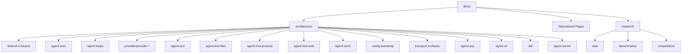

# Brain Docs

This directory is now split into three layers so architecture, operations, and
research do not blur together:

| Area | Purpose | Read this when |
| --- | --- | --- |
| [`architecture/README.md`](architecture/README.md) | Current-state architecture map for the workspace | You want to understand how the engine is put together today |
| [`Harbor.md`](Harbor.md) | Operational Harbor runbook and benchmark workflow | You need to run or interpret Harbor jobs |
| [`research/README.md`](research/README.md) | Source-first exploratory notes and external comparison work | You are evaluating ACP, benchmarks, or adjacent systems |

## Recommended Reading Order

1. [`architecture/README.md`](architecture/README.md)
2. [`architecture/types.md`](architecture/types.md)
3. [`architecture/core/README.md`](architecture/core/README.md)
4. [`architecture/loops/README.md`](architecture/loops/README.md)
5. [`Harbor.md`](Harbor.md) and [`architecture/atif.md`](architecture/atif.md) if you are working on benchmarking

## Documentation Rules Of Thumb

| Document type | What it should optimize for | What it should avoid |
| --- | --- | --- |
| Architecture docs | clear boundaries, current responsibilities, data flow | speculative product planning |
| Operational docs | exact commands, prerequisites, current workflows | deep design rationale |
| Research docs | source-first notes, option analysis, ecosystem mapping | being treated as the current implementation contract |

## Current Information Architecture

