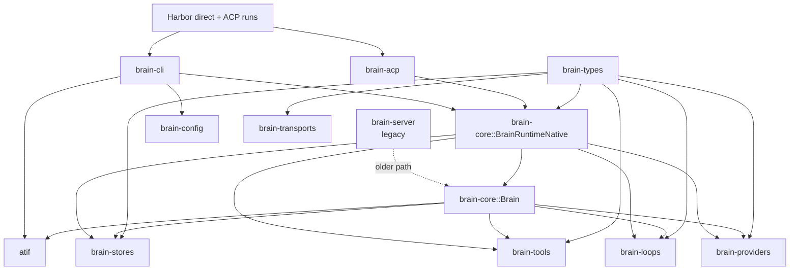

# Architecture Overview

This section documents the current `brain` stack as it exists in code today.
It is meant to make the crate boundaries legible before deeper refactors,
especially around agent loops, multimodal message flow, ACP, and benchmarking.

## Stack At A Glance

| Layer | Crates | Role in the stack | Current status |
| --- | --- | --- | --- |
| Contracts | [`types.md`](types.md) | Shared traits, messages, events, config, session, and runtime contracts | Stable foundation |
| Engine | [`core/README.md`](core/README.md) | `Brain`, `BrainRuntime`, `BrainRuntimeNative`, and future remote runtime shape | Core orchestration |
| Reusable session engine | [`agent-runtime/README.md`](agent-runtime/README.md) | Runtime/loop boundary for the newer storeless session engine and child-runtime substrate | Active greenfield path |
| Execution strategies | [`loops/README.md`](loops/README.md) | `simple`, `robust`, `terminus2`, `terminus-kira` | Highest churn / experimental pressure |
| Runtime capabilities | [`tools/README.md`](tools/README.md), [`provider/README.md`](provider/README.md), [`stores/README.md`](stores/README.md), [`transports.md`](transports.md), [`config.md`](config.md) | Tool execution, provider backends, persistence, transport, config layering | Mixed maturity |
| Client surfaces | [`cli.md`](cli.md), [`acp.md`](acp.md) | Local CLI, benchmark exec path, ACP bridge/runtime surface | Active product surfaces |
| Benchmark/export surfaces | [`atif.md`](atif.md) | ATIF transcript/export model for Harbor-facing runs | Important integration layer |
| Deferred legacy surface | [`server.md`](server.md) | Older server/API abstraction kept out of the active architecture path | Legacy / deferred |

## System Map



## Runtime Turn Flow

```mermaid
sequenceDiagram
    participant Client as CLI / ACP client
    participant Runtime as BrainRuntimeNative
    participant Store as Store
    participant Loop as AgentLoop
    participant Provider as Provider
    participant Tool as Tool
    participant Atif as ATIF builder

    Client->>Runtime: turn(session_id, input)
    Runtime->>Store: load session + project config
    Runtime->>Runtime: resolve provider, loop, tools
    Runtime->>Loop: run(messages, config, cancel)
    Loop->>Provider: chat(messages, tools, inference)
    Provider-->>Loop: token deltas / tool calls / usage
    Loop->>Tool: execute(...) as needed
    Tool-->>Loop: tool result
    Loop-->>Runtime: Event stream
    Runtime->>Store: persist user/assistant/tool messages
    Runtime->>Atif: append trajectory state and completion events
    Runtime-->>Client: live events + TurnDone
```

## Design Reading

| Question | Primary doc |
| --- | --- |
| What are the canonical contracts? | [`types.md`](types.md) |
| What is the difference between `Brain`, `BrainRuntime`, and `BrainRuntimeNative`? | [`core/README.md`](core/README.md) |
| What belongs in `agent-runtime` versus a loop strategy? | [`agent-runtime/README.md`](agent-runtime/README.md) |
| Where are the experimental loop ideas concentrated? | [`loops/README.md`](loops/README.md) |
| How do tools stay swappable across native and ACP-backed execution? | [`tools/README.md`](tools/README.md) |
| How do provider backends handle presets, auth, and multimodal requests? | [`provider/README.md`](provider/README.md) |
| How is durable state stored and observed? | [`stores/README.md`](stores/README.md) |
| How does config get layered from defaults, global state, and project files? | [`config.md`](config.md) |
| How do CLI and ACP sit on top of the runtime? | [`cli.md`](cli.md), [`acp.md`](acp.md) |
| How does Harbor-facing transcript export work? | [`atif.md`](atif.md) |

## Current Architectural Reading

| Area | Healthy pattern | Current pressure point |
| --- | --- | --- |
| Core boundary | `brain-types` keeps the main seams explicit | More behavior is now traveling through events and richer message content |
| Runtime assembly | `BrainRuntimeNative` gives one place to resolve providers, loops, and tools | More responsibilities are accumulating around session state and client integration |
| Loop experimentation | Loop work is isolated in `brain-loops` instead of hardcoding policy in `brain-core` | `terminus2` and `terminus-kira` are materially different from `simple`/`robust` |
| Tooling | Driver pattern keeps tool contracts stable while swapping execution backends | ACP-backed file access and persistent terminal sessions expand the contract surface |
| Benchmarks | `brain-cli exec` and `atif` give a direct benchmark/export path | Harbor and loop work are influencing architecture faster than the docs had kept up |
