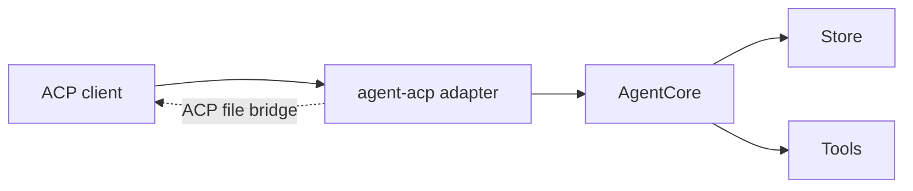

# agent-acp

`agent-acp` is the ACP-facing adapter surface. It adapts ACP sessions, events,
capabilities, and client-owned filesystem behavior onto the shared
`AgentCore` boundary rather than inventing a second runtime model.

## Main Pieces

| Area | Role |
| --- | --- |
| adapter modules | Real ACP adapter over `AgentCore` |
| capability mapping | Exposes ACP initialize/session capability state from real runtime state |
| event mapper | Converts runtime/core events into ACP updates |
| history replay | Reconstructs ACP session updates from stored history when needed |
| ACP tool bridge | Routes file reads and writes through client capabilities when available |

## Runtime Position

## Why It Matters

| Concern | Current behavior |
| --- | --- |
| Canonical core boundary | ACP uses the same core boundary as the CLI and hosted server |
| Session state | ACP model and loop state are grounded in real session/project config, not ACP-local shadow state |
| Client-owned capabilities | ACP-backed file operations can target the client-managed workspace instead of the backend host only |
| Validation path | The adapter stays reusable while the CLI can still expose an `agent acp` launch path |

## Current Reading

`agent-acp` is an active application adapter. It reuses the shared agent core
while adapting to a client-driven protocol and client-owned capabilities
model.
