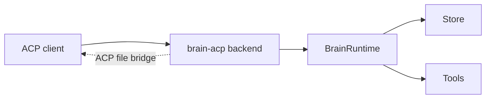

# brain-acp

`brain-acp` is the ACP-facing application surface. It adapts ACP sessions,
events, capabilities, and client-owned filesystem behavior onto the shared
`BrainRuntime` boundary rather than inventing a second runtime model.

## Main Pieces

| Area | Role |
| --- | --- |
| `backend/` | Real ACP backend over `BrainRuntime` |
| `mock/` | Mock ACP backend for compatibility validation |
| capability mapping | Exposes ACP initialize/session capability state from real runtime state |
| event mapper | Converts `brain` events into ACP updates |
| history replay | Reconstructs ACP session updates from stored history when needed |
| ACP tool bridge | Routes file reads and writes through client capabilities when available |

## Runtime Position

## Why It Matters

| Concern | Current behavior |
| --- | --- |
| Canonical runtime | ACP uses the same runtime boundary as the CLI |
| Session state | ACP model and loop state are grounded in real session/project config, not ACP-local shadow state |
| Client-owned capabilities | ACP-backed file operations can target the client-managed workspace instead of the backend host only |
| Validation path | Mock and real binaries let the repo test interoperability separately from full runtime behavior |

## Current Reading

`brain-acp` is no longer just a thin future bridge. It is an active app surface
that reuses the native runtime while adapting to a client-driven protocol and
client-owned capabilities model.
