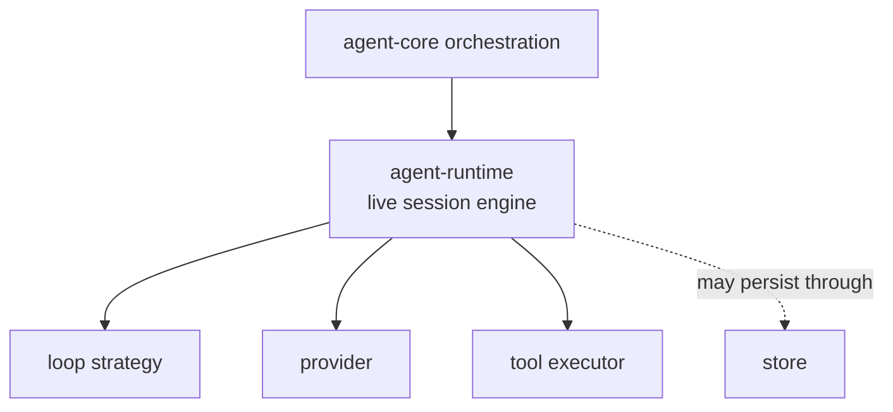
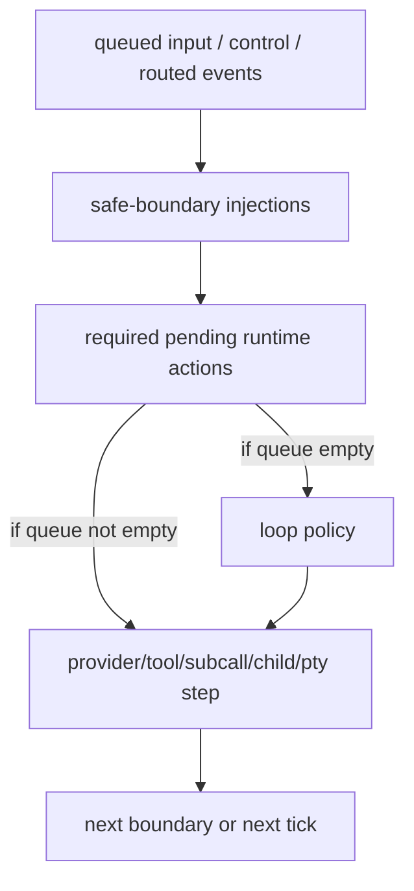

# Agent Runtime

`agent-runtime` is the live execution engine for one agent session.

If you want the shortest possible description:

- the **provider** thinks
- the **tools** do
- the **loop** chooses the next step
- the **store** persists state
- the **runtime** keeps the whole session alive, coherent, and safe while those pieces interact

If `provider` is the model backend and `loop` is the strategy, then the runtime is the part that behaves like the session's control tower. It owns the live state, sequences work, applies boundaries, routes child/PTY events, and decides when transcript-visible runtime facts are allowed to reach the model.

## Table Of Contents

| Topic | Purpose |
| --- | --- |
| [What Is A Runtime?](#what-is-a-runtime) | Conceptual explanation before implementation details |
| [Where Runtime Fits](#where-runtime-fits-in-the-architecture) | Relationship to provider, tools, loops, store, and core |
| [Core Mental Model](#core-mental-model) | Main distinctions that are easy to confuse |
| [High-Level Flow](#high-level-flow) | One turn from input to boundary |
| [Source Pointers](#source-pointers) | Main implementation files |
| [Further Reading](#further-reading) | Deep-dive pages in this doc set |

## What Is A Runtime?

A runtime is a **long-lived execution engine for one live agent session**.

In practice that means it owns:

- the current transcript
- the active phase and visible boundary
- queued input and queued state-changing runtime actions
- approval, wait, and interrupt state
- child runtime snapshots and routing
- PTY session snapshots and subscriptions
- safe-boundary transcript injection for runtime-originated facts
- event emission and control-plane bookkeeping

What the runtime is **not**:

- not the model backend
- not the loop policy itself
- not persistence
- not the outer product shell

Analogy:

- the **provider** is the engine that generates words or tool calls
- the **loop** is the navigator that says "next, do this"
- the **runtime** is the cockpit plus flight-control system that keeps the trip coherent

That distinction matters because many behaviors that first look like "prompting" or "loop logic" are actually runtime responsibilities:

- safe transcript mutation
- tool approval gating
- child lifecycle tracking
- wait holds and timeout release
- PTY event buffering and promotion
- direct reads vs queued mutations

## Where Runtime Fits In The Architecture

`agent-runtime` sits below product-level orchestration and above the raw provider/tool/store surfaces.



### Architecture Component Map

| Component | Main job | What it does not own | Why runtime still matters |
| --- | --- | --- | --- |
| Provider | Inference, streaming, tool-call emission, usage metadata | Session lifecycle, child state, PTY state, waits, approvals | Runtime decides when and how provider work is allowed to run |
| Tool executor | Execute requested tools | Transcript control, phase/boundary control, child/PTy orchestration | Runtime decides when tools run and how results affect session state |
| Loop strategy | Decide the next runtime action | Direct mutation of runtime internals, event routing, safe-boundary rules | Runtime asks the loop for policy only after required work is handled |
| Store | Persist durable data when used | Live turn execution | Runtime owns the active in-memory control plane |
| Core / AgentCore | Compose runtime + provider + tools + config into a product surface | Fine-grained live session mechanics | Runtime is the reusable execution substrate inside the larger system |

### Legacy Placement

If you know the older `brain-core` architecture, treat `agent-runtime` as the
newer reusable session engine underneath the current `agent-core` product
boundary.

- `agent-core` is the larger orchestration shell
- `agent-runtime` is the session execution substrate

In other words:

- `agent-core` answers "how does the product assemble the whole stack?"
- `agent-runtime` answers "how does one live agent session actually run?"

## Core Mental Model

These distinctions are the ones engineers most often blur together.

### Runtime vs Loop

The runtime owns **mechanics**. The loop owns **policy**.

Example:

- runtime knows how to start a provider step, queue a child report, wait on children, or open a PTY
- loop decides whether the next step should be `RunProvider`, `WaitForAgents`, `CompactContext`, or some other `LoopDecision`

Do not confuse:

- "the loop wants to do something next"
- with
- "the runtime already knows how to execute that thing safely"

See [control-flow.md](control-flow.md) and [decisions-and-events.md](decisions-and-events.md).

### Session Command vs Loop Decision

A `SessionCommand` is an **external request** into the engine.

A `LoopDecision` is an **internal executable step** chosen inside the runtime control flow.

Analogy:

- `SessionCommand` is "someone asks the runtime to do something"
- `LoopDecision` is "the next step the runtime actually executes"

Mutating external requests are turned into required pending runtime actions and later drained through the normal decision path. Reads stay direct.

See [decisions-and-events.md](decisions-and-events.md).

### Direct Read vs Required Runtime Action

A direct read is a query like:

- list visible PTYs
- read agent mail
- fetch recent PTY events

A required runtime action is a state-changing step like:

- spawn agent
- send agent input
- open PTY
- execute PTY batch

Analogy:

- a direct read is "look at the dashboard"
- a required runtime action is "move a control lever"

The runtime keeps those separate so the architecture stays understandable.

### Runtime Event vs Developer Message

A `RuntimeEvent` is a control-plane fact emitted for observers and integration code.

A `Developer` message is a transcript-visible rendering of some runtime-originated fact after the runtime decides it is safe to expose it to the model.

Not every event becomes a message.

Examples that may later render as `Developer` messages:

- direct agent messages
- semantic child reports
- PTY subscription events with `PromoteToDeveloper`

See [messaging.md](messaging.md) and [transcript-and-boundaries.md](transcript-and-boundaries.md).

### PTY vs Shell Tool

A shell tool is usually a one-shot command execution.

A PTY is a long-lived interactive terminal session with:

- stable id
- buffered output
- resize
- interrupt
- backgrounding
- event subscriptions

Analogy:

- shell tool: "run one command and tell me the output"
- PTY: "open a terminal tab and let me keep using it"

See [pty.md](pty.md).

## High-Level Flow

At a high level, one session tick works like this:



The most important rule is:

- the runtime applies safe-boundary work first
- then drains required queued mutations
- only then asks the loop for ordinary policy

That is what keeps "external request", "runtime mechanism", and "loop judgment" from collapsing into one muddled concept.

For the concrete mechanics, see [control-flow.md](control-flow.md).

## Example: A Small Loop Over A Rich Runtime

[`SimpleLoop`](../../../crates/agent-loops/src/simple.rs) is intentionally small:

```rust
if let Some(request) = state.pending_approval.clone() {
    return Ok(LoopDecision::RequestToolApproval { request });
}

if !waiting_children.is_empty() {
    return Ok(LoopDecision::WaitForAgents { ids: waiting_children, wait: WaitRequest::default() });
}

if !state.pending_tool_calls.is_empty() {
    return Ok(LoopDecision::ExecuteToolBatch);
}
```

That snippet is the point of the architecture:

- the loop stays compact
- the runtime underneath it stays powerful
- advanced mechanics like PTYs, subcalls, child routing, and safe-boundary injections do not require stuffing all execution details into one monolithic loop

Read the full implementation in [`simple.rs`](../../../crates/agent-loops/src/simple.rs).

## Source Pointers

| File | Why it matters |
| --- | --- |
| [`engine.rs`](../../../crates/agent-runtime/src/engine.rs) | Main execution loop, safe boundaries, action draining, provider/tool/PTY orchestration |
| [`session.rs`](../../../crates/agent-runtime/src/session.rs) | `SessionState`, phases, boundaries, child state, PTY state, advisories |
| [`command.rs`](../../../crates/agent-runtime/src/command.rs) | External commands, spawn/wait/message/PTy request shapes |
| [`loop_strategy.rs`](../../../crates/agent-runtime/src/loop_strategy.rs) | `LoopContext`, `LoopDecision`, loop/runtime boundary |
| [`event.rs`](../../../crates/agent-runtime/src/event.rs) | Runtime event stream |
| [`pty.rs`](../../../crates/agent-runtime/src/pty.rs) | Runtime-managed PTY implementation |
| [`simple.rs`](../../../crates/agent-loops/src/simple.rs) | Canonical small default loop |

## Further Reading

| Document | Focus |
| --- | --- |
| [control-flow.md](control-flow.md) | Turn lifecycle, queued mutations, safe boundaries, direct reads |
| [state.md](state.md) | `SessionState` buckets and what each one means |
| [decisions-and-events.md](decisions-and-events.md) | `SessionCommand`, `LoopDecision`, `RuntimeEvent`, and related matrices |
| [subagents.md](subagents.md) | Child runtime lifecycle, waits, registry routing, reports |
| [pty.md](pty.md) | PTY lifecycle, subscriptions, captures, backgrounding, developer promotion |
| [messaging.md](messaging.md) | Mail, direct messages, envelopes, reports, and messaging semantics |
| [transcript-and-boundaries.md](transcript-and-boundaries.md) | Safe-boundary transcript mutation, developer-message injection, compaction |

## Practical Reading Order

If you are new to the runtime:

1. read this page
2. read [control-flow.md](control-flow.md)
3. read [state.md](state.md)
4. then branch into [subagents.md](subagents.md), [pty.md](pty.md), or [messaging.md](messaging.md)

If you are changing code:

1. start from [`engine.rs`](../../../crates/agent-runtime/src/engine.rs)
2. cross-check the matching deep-dive page
3. then inspect the related types in [`command.rs`](../../../crates/agent-runtime/src/command.rs), [`session.rs`](../../../crates/agent-runtime/src/session.rs), and [`event.rs`](../../../crates/agent-runtime/src/event.rs)
