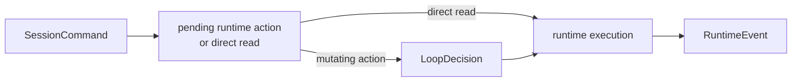

# Decisions And Events

This page explains the runtime's main control surfaces:

- `SessionCommand`
- `AgentCommand`
- `PtyCommand`
- `LoopDecision`
- `RuntimeEvent`

The easiest way to stay oriented is to remember:

- commands come **into** the runtime
- decisions are steps the runtime **executes**
- events come **out** of the runtime

## SessionCommand

[`SessionCommand`](../../../crates/agent-runtime/src/command.rs) is the outer command surface accepted by the session engine.

### SessionCommand Matrix

| Variant | Purpose | Direct or queued? | Notes |
| --- | --- | --- | --- |
| `SubmitInput` | queue transcript input for the next turn | direct | becomes pending input |
| `Control` | interrupt, steer, pause, resume | direct | updates runtime-owned control state |
| `Approve` | resolve approval gate | direct | unblocks tool execution |
| `Agent` | child-runtime work and messaging | mixed | reads direct, mutations queued |
| `Pty` | PTY control and queries | mixed | reads direct, mutations queued |

## AgentCommand

[`AgentCommand`](../../../crates/agent-runtime/src/command.rs) is the child-runtime and cross-agent control surface.

### AgentCommand Matrix

| Variant | Mutates runtime state? | Queued into required action path? | Typical use |
| --- | --- | --- | --- |
| `SpawnAgent` | yes | yes | create child runtime |
| `SendAgentInput` | yes | yes | deliver transcript-like input to another runtime |
| `SendAgentMessage` | yes, but transport-oriented | direct today | mailbox/direct messaging |
| `InterruptAgent` | yes | yes | interrupt another runtime |
| `PauseAgent` | yes | yes | pause another runtime |
| `ResumeAgent` | yes | yes | resume another runtime |
| `WaitForAgents` | yes | yes | hold on child/runtime completion |
| `ReadAgentMessages` | no | direct | mailbox query |
| `ListAgents` | no | direct | child listing |

Important distinction:

- `SendAgentInput` behaves like "inject more working input into another runtime"
- `SendAgentMessage` behaves more like "send a routed message or note"

Those are related but not the same abstraction.

## PtyCommand

[`PtyCommand`](../../../crates/agent-runtime/src/command.rs) is the PTY-facing command surface.

### PtyCommand Matrix

| Variant | Mutates PTY/runtime state? | Queued or direct? | Meaning |
| --- | --- | --- | --- |
| `OpenPty` | yes | queued | create new managed PTY |
| `ListPtys` | no | direct | list visible PTY snapshots |
| `GetPty` | no | direct | fetch one PTY snapshot |
| `WritePtyInput` | yes | queued | write raw input |
| `ExecutePtyBatch` | yes | queued | run one or more PTY steps |
| `CapturePty` | yes in the sense of runtime-visible capture result | queued | capture visible screen/incremental output |
| `ResizePty` | yes | queued | resize PTY |
| `InterruptPty` | yes | queued | send ctrl-c |
| `BackgroundPty` | yes | queued | release foreground expectation while keeping PTY alive |
| `ClosePty` | yes | queued | terminate PTY |
| `SubscribePty` | yes | queued | subscribe runtime to PTY events |
| `UnsubscribePty` | yes | queued | remove subscription |
| `ReadPtyEvents` | no | direct | read delivered PTY events |

## LoopDecision

[`LoopDecision`](../../../crates/agent-runtime/src/loop_strategy.rs) is the internal effect surface the runtime executes.

Short excerpt:

```rust
pub enum LoopDecision {
    RunProvider,
    ExecuteToolBatch,
    SpawnAgent { .. },
    WaitForAgents { .. },
    RunSubcall { .. },
    RewriteTranscript { .. },
    OpenPty { .. },
    ExecutePtyBatch { .. },
    InterruptAgent { .. },
    CompactContext,
}
```

The full enum is in [`loop_strategy.rs`](../../../crates/agent-runtime/src/loop_strategy.rs).

### LoopDecision Matrix

| Decision family | Examples | What it changes |
| --- | --- | --- |
| Provider/tool flow | `RunProvider`, `ExecuteToolBatch`, `RequestToolApproval`, `FinishTurn` | active turn progress |
| Child runtime control | `SpawnAgent`, `WaitForAgents`, `SendAgentInput`, `InterruptAgent`, `PauseAgent`, `ResumeAgent` | registry-routed runtime state |
| Transcript and subcalls | `RunSubcall`, `RewriteTranscript`, `AppendTranscriptMessages`, `QueueSteering`, `CompactContext` | transcript or transcript-related runtime state |
| PTY control | `OpenPty`, `WritePtyInput`, `ExecutePtyBatch`, `CapturePty`, `ResizePty`, `InterruptPty`, `BackgroundPty`, `ClosePty`, `SubscribePty`, `UnsubscribePty` | runtime-managed PTY state |

### Who Usually Causes A LoopDecision?

| Decision source | Typical examples |
| --- | --- |
| Loop policy | `RunProvider`, `CompactContext`, `QueueSteering`, `WaitForInput` |
| Required queued mutation | `SpawnAgent`, `OpenPty`, `ExecutePtyBatch`, `InterruptAgent` |
| Runtime gating state | `RequestToolApproval`, `WaitForAgents` |

That mix is intentional. The runtime has one executable action surface even though the reasons for an action differ.

## RuntimeEvent

[`RuntimeEvent`](../../../crates/agent-runtime/src/event.rs) is the outward event stream for observers, UIs, and integration code.

### RuntimeEvent Matrix

| Event family | Examples | Model-visible by itself? |
| --- | --- | --- |
| Input/control | `InputQueued`, `ControlQueued` | no |
| Phase/boundary | `PhaseChanged`, `BoundaryReached`, `TurnStarted`, `TurnFinished` | no |
| Steering/approval | `SteeringQueued`, `SteeringApplied`, `ApprovalRequested`, `ApprovalResolved` | no |
| Child lifecycle | `ChildSpawnRequested`, `ChildSpawned`, `ChildStatusChanged`, `ChildCompleted`, `ChildFailed` | no |
| Agent transport | `AgentInputQueued`, `AgentInputDelivered`, `AgentMessageQueued`, `AgentMessageDelivered` | no |
| Waiting | `AgentWaitTimedOut` | no |
| Child reporting | `ChildReportReceived`, `ChildReportInjected` | injected form becomes transcript-visible |
| PTY lifecycle | `PtyOpened`, `PtyUpdated`, `PtyEventEmitted`, `PtySubscribed`, `PtyEventDelivered`, `PtyEventInjected`, `PtyCaptured` | injected form may become transcript-visible |
| Envelope routing | `EnvelopeQueued`, `EnvelopeDelivered`, `EnvelopeReceived` | no |
| Provider/tool streaming | `OutputBlockStart`, `OutputBlockDelta`, `OutputBlockStop`, `Usage`, `ToolCallPending`, `ToolCallStarted`, `ToolCallFinished` | not directly |
| Transcript mutation | `MessageCommitted`, `SubcallFinished`, `TranscriptRewritten`, `TranscriptMessagesAppended` | transcript effects are visible because they mutate transcript |
| Advice/errors | `Compaction`, `DoomLoopWarning`, `Retry`, `Error` | no |

### Runtime Event vs Transcript Message

Do not confuse:

- `RuntimeEvent::PtyEventInjected`
- with
- the PTY event itself

The event says:

- "the runtime injected something"

The message says:

- "this is the model-visible developer-form rendering of that fact"

The same separation exists for:

- child reports
- direct agent messages

## How Commands, Decisions, And Events Relate



## A Good Rule Of Thumb

When you see a new capability, ask three questions:

1. how does it enter the runtime?
2. which `LoopDecision` executes it?
3. which `RuntimeEvent`s describe it afterward?

If one of those answers is missing, the architecture is probably incomplete.

## Related Reading

- [control-flow.md](control-flow.md)
- [state.md](state.md)
- [subagents.md](subagents.md)
- [pty.md](pty.md)
- [messaging.md](messaging.md)
