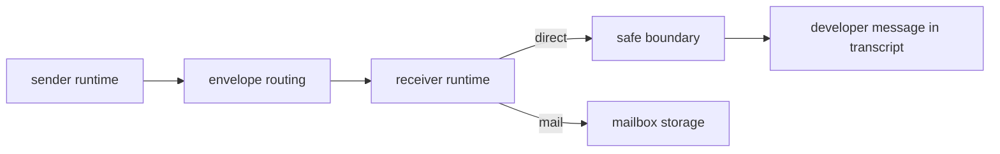

# Messaging

This page explains messaging across runtimes and how that differs from transcript input and semantic reports.

## The Main Distinctions

Three concepts sound similar but are intentionally different:

- `AgentMessage`
- `ChildReport`
- transcript-visible `Developer` messages

### AgentMessage

An `AgentMessage` is a routed message between runtimes.

It carries:

- sender runtime id
- recipient runtime id
- delivery mode
- semantic kind
- structured payload

### ChildReport

A `ChildReport` is a semantic report that may later be rendered into the parent's transcript.

It is more structured and parent-facing than a generic agent message.

### Developer Message

A transcript `Developer` message is the model-visible rendering the runtime commits at a safe boundary.

It is not the transport object itself.

Analogy:

- `AgentMessage` is the postal item
- `ChildReport` is a typed management update
- `Developer` message is the final note pinned onto the parent's workspace for the model to see

## Direct vs Mail

`AgentMessageDelivery` has two modes:

- `Direct`
- `Mail`

### Delivery Matrix

| Mode | Stored where? | When does it surface? | Transcript effect |
| --- | --- | --- | --- |
| `Direct` | mailbox plus pending direct queue | next safe boundary | rendered into transcript as runtime-originated context |
| `Mail` | mailbox | only when explicitly read | no automatic transcript injection |

Direct is not the same as "instant transcript injection." It still waits for a safe boundary.

## Envelope Routing

Runtime-to-runtime transport uses `Envelope`s.

Important `EnvelopeKind`s include:

- `Input`
- `Steer`
- `Interrupt`
- `Pause`
- `Resume`
- `Progress`
- `Result`
- `Mail`

This is the lower-level routing layer under higher-level conveniences like:

- `SendAgentInput`
- `SendAgentMessage`
- child reports

## Agent Input vs Agent Message

This distinction is easy to miss.

### SendAgentInput

Acts like routed transcript-like input for another runtime.

The recipient eventually applies it through local staging and safe-boundary handling.

### SendAgentMessage

Acts like routed communication between runtimes, with direct or mailbox semantics.

Analogy:

- `SendAgentInput`: "please incorporate this as working context"
- `SendAgentMessage`: "here is a note or result for you"

## Message Kinds

`AgentMessageKind` includes:

- `Message`
- `Question`
- `Observation`
- `Result`
- `Progress`

These are semantic labels for filtering and UI, but they do not by themselves decide transcript behavior. Delivery mode still matters.

## Messaging Flow

## Child Report vs Agent Message vs PTY Promotion

### Comparison Matrix

| Mechanism | Main purpose | Stored in mailbox? | Automatically transcript-visible? |
| --- | --- | --- | --- |
| `AgentMessage` with `Mail` | deferred inter-runtime communication | yes | no |
| `AgentMessage` with `Direct` | boundary-surfaced runtime message | yes | yes, at safe boundary |
| `ChildReport` | semantic child update or result | no, dedicated report path | yes, at safe boundary |
| PTY `PromoteToDeveloper` event | model-visible PTY observation | no, PTY event buffers | yes, at safe boundary |

These all end up looking somewhat similar in transcript, but they arrive there by different routes.

## Why The Runtime Uses Developer Messages

When the runtime injects a direct message, child report, or promoted PTY event, it renders it as a `Developer` message because the content is runtime-authored context, not model-authored assistant text.

That preserves provenance:

- the model did not say it
- the user did not say it
- the runtime is informing the model about the state of the world

See [transcript-and-boundaries.md](transcript-and-boundaries.md).

## Source Pointers

- [`command.rs`](../../../crates/agent-runtime/src/command.rs)
- [`engine.rs`](../../../crates/agent-runtime/src/engine.rs)
- [`session.rs`](../../../crates/agent-runtime/src/session.rs)

## Related Reading

- [subagents.md](subagents.md)
- [transcript-and-boundaries.md](transcript-and-boundaries.md)
- [decisions-and-events.md](decisions-and-events.md)
