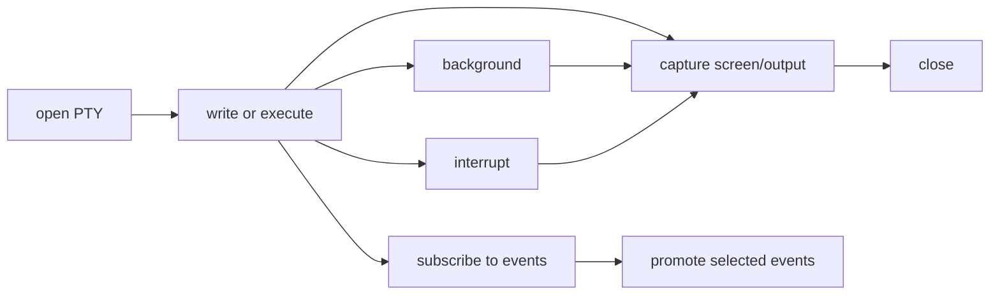

# PTYs

This page explains runtime-managed PTY support.

## What Is A PTY?

A PTY is a **pseudo-terminal**: a programmable interactive terminal session.

The easiest distinction is:

- shell tool: "run one command and give me output"
- PTY: "open a terminal window and let me keep using it"

That difference is why PTY support lives in the runtime instead of being treated as just another one-shot tool.

## Why PTY Is Runtime-Managed

A PTY has the properties of a managed runtime resource:

- stable identity
- lifecycle
- mutable status
- output buffering
- backgrounding
- interrupt behavior
- event subscriptions

That makes it architecturally closer to a child runtime than to a stateless shell tool.

## PTY State

`PtySessionState` lives in [`command.rs`](../../../crates/agent-runtime/src/command.rs), while the implementation lives in [`pty.rs`](../../../crates/agent-runtime/src/pty.rs).

Important fields:

- `pty_id`
- `owner_runtime_id`
- `cwd`
- `rows` / `cols`
- `status`
- `output_cursor`
- `exit_code`

### PTY Status Matrix

| Status | Meaning |
| --- | --- |
| `Starting` | PTY is being created |
| `Idle` | PTY is alive and not currently foreground-active |
| `Running` | PTY recently received active input/execution |
| `Backgrounded` | PTY is still alive but explicitly released from foreground expectation |
| `Closed` | PTY terminated cleanly |
| `Failed` | PTY failed unexpectedly |

## PTY Lifecycle



## PTY Actions

### PTY Action Matrix

| Action | Purpose | Direct read or queued mutation? |
| --- | --- | --- |
| `OpenPty` | create PTY | queued mutation |
| `ListPtys` | list PTY snapshots | direct read |
| `GetPty` | read one PTY snapshot | direct read |
| `WritePtyInput` | send raw text/keys | queued mutation |
| `ExecutePtyBatch` | run one or more steps | queued mutation |
| `CapturePty` | capture screen or incremental output | queued mutation in current design |
| `ResizePty` | update rows/cols | queued mutation |
| `InterruptPty` | send ctrl-c | queued mutation |
| `BackgroundPty` | keep PTY alive but non-blocking | queued mutation |
| `ClosePty` | terminate PTY | queued mutation |
| `SubscribePty` | subscribe current runtime to PTY events | queued mutation |
| `UnsubscribePty` | remove subscription | queued mutation |
| `ReadPtyEvents` | query delivered events | direct read |

## PTY Capture Modes

`PtyCaptureMode` has two meanings:

- `VisibleScreen`
- `Incremental`

### VisibleScreen

Read the current rendered terminal screen.

### Incremental

Read the rendered screen plus buffered output since a prior cursor.

Analogy:

- visible screen: "what is on the terminal right now?"
- incremental: "what changed since the last time I looked?"

## Output Cursor

The PTY uses `output_cursor` as a monotonic progress marker for buffered output.

Why this exists:

- repeated reads should not have to duplicate the whole buffer
- consumers can ask "what changed since cursor X?"

This is one reason PTY feels much richer than a shell command result.

## PTY Implementation Notes

[`pty.rs`](../../../crates/agent-runtime/src/pty.rs) uses `portable_pty` plus `vt100`.

Important implementation behaviors:

- PTY shell starts as interactive `bash`
- output is buffered up to a bounded window
- a virtual terminal parser maintains visible screen contents
- events are emitted on output, status changes, resize, interrupt, and close

Short excerpt:

```rust
state.push_event(
    PtyEventKind::ExecutionCompleted,
    serde_json::json!({
        "steps": request.steps,
        "backgrounded": request.background,
        "output_cursor": snapshot.output_cursor,
    }),
    &self.event_tx,
);
```

See the full code in [`pty.rs`](../../../crates/agent-runtime/src/pty.rs).

## PTY Subscriptions

PTY subscriptions let one runtime observe PTY events explicitly.

### PTY Subscription Delivery Matrix

| Delivery | Meaning | Transcript effect |
| --- | --- | --- |
| `StreamOnly` | keep events in runtime-observable state only | none by default |
| `PromoteToDeveloper` | queue matching events for transcript promotion | rendered later as `Developer` messages at safe boundaries |

This distinction is critical:

- subscription delivery is a runtime concern
- transcript promotion is a later boundary concern

They are not the same step.

## PTY Event Flow

1. PTY emits an internal `PtyEvent`
2. matching subscriptions deliver `DeliveredPtyEvent` to the runtime
3. runtime stores it in `recent_pty_events`
4. if delivery is `PromoteToDeveloper`, runtime also stages it in `pending_promoted_pty_events`
5. at a safe boundary, the runtime renders a `Developer` message into transcript

See [transcript-and-boundaries.md](transcript-and-boundaries.md).

## Background vs Close

These two states are intentionally different.

### Background

The PTY is still alive. The runtime is just no longer treating it as foreground work.

### Close

The PTY is terminated.

Do not confuse:

- "I am not waiting on this PTY right now"
- with
- "this PTY no longer exists"

## Interrupt vs Background

Interrupt sends control intent to the running PTY workload, typically like ctrl-c.

Background changes runtime scheduling expectations without killing the session.

That separation lets the runtime model real terminal workflows more honestly.

## Related Reading

- [control-flow.md](control-flow.md)
- [state.md](state.md)
- [decisions-and-events.md](decisions-and-events.md)
- [transcript-and-boundaries.md](transcript-and-boundaries.md)
