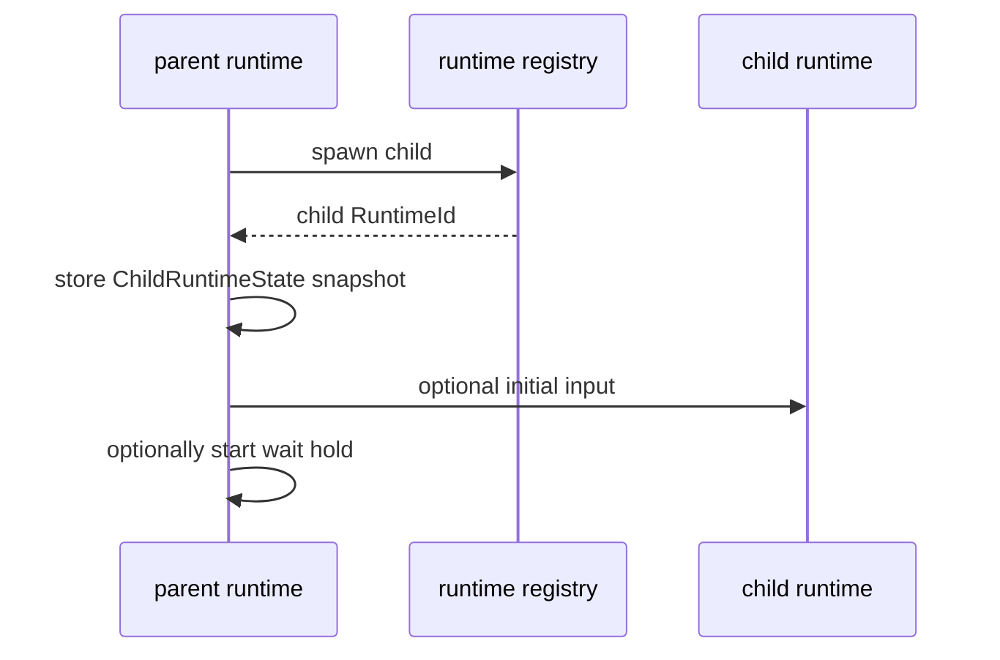

# Subagents

This page explains how the runtime manages child runtimes.

The key idea is simple:

- a child runtime is another runtime with its own session state
- the parent does not embed it directly
- both parent and child are addressed through a flat registry by stable id

## Mental Model

Do not think of subagents as nested function calls.

They are closer to **managed sibling sessions connected by routing and policy**.

Analogy:

- a parent runtime is a manager
- child runtimes are workers in the same company directory
- the registry is the directory and routing desk

That is why ids matter so much.

## Flat Registry By Id

Child runtimes are managed through stable `RuntimeId`s, not through a deeply nested object tree.

Why this design helps:

- routing stays simple
- parent/child relationships are explicit
- waiting, pausing, and interrupting do not require climbing ownership trees
- messaging works even when runtimes are concurrent or backgrounded

In local parent state, `children` stores only `ChildRuntimeState` snapshots. The live runtime itself is looked up through the registry.

## Spawn Request Surface

The child spawn surface lives in [`command.rs`](../../../crates/agent-runtime/src/command.rs) as `SpawnRequest`.

Important fields:

- `label`
- `initial_input`
- `spawn_mode`
- `result_mode`
- `history_mode`
- optional profile/model/config/loop overrides

### Spawn Mode Matrix

| SpawnMode | Parent behavior | Child lifetime meaning |
| --- | --- | --- |
| `AwaitCompletion` | parent expects to wait | child is blocking relative to parent progress |
| `Concurrent` | parent may keep working | child runs alongside local work |
| `Background` | parent does not hold the current turn for it | child may outlive the parent's immediate work |

### Result Mode Matrix

| ResultMode | Meaning |
| --- | --- |
| `FinalResultOnly` | only final completion result is returned automatically |
| `Mailbox` | parent and child may exchange mailbox messages during execution |

### History Mode Matrix

| HistoryMode | Meaning |
| --- | --- |
| `Empty` | child starts with an empty transcript |
| `ForkParentTranscript` | child starts with a fork of the parent transcript |

## Spawn Flow



The execution lives in [`engine.rs`](../../../crates/agent-runtime/src/engine.rs), especially the child spawn and child watcher paths.

## Waiting, Blocking, And Backgrounding

These concepts are related but not interchangeable.

### Blocking

Blocking means the parent currently holds progress waiting on child completion.

This is represented through `WaitForAgents` and `active_wait`.

### Concurrent

Concurrent means the child is alive and important, but the parent may keep doing its own work.

### Background

Background means the child may continue after the parent has released immediate concern for it.

Do not confuse:

- "child still exists"
- with
- "parent is currently waiting"

Those are different runtime states.

### Wait Timeout Behavior

`WaitRequest` contains:

- optional `timeout_ms`
- `on_timeout`

`on_timeout` can be:

- `ReleaseHold`
- `InterruptChild`

That distinction exists because timing out does not automatically mean the child should die.

## Child Status Tracking

`ChildStatus` records the parent's snapshot of child lifecycle:

- `Starting`
- `Running`
- `AwaitingInput`
- `Paused`
- `Completed`
- `Failed`
- `Cancelled`

The parent updates these by watching child runtime events.

## Reports vs Results vs Messages

These are easy to blur together.

### Child Result

`ChildResult` is the structured completion summary retained for a completed child.

### Child Report

`ChildReport` is a semantic child-to-parent report that may later be promoted into transcript as a `Developer` message.

Kinds include:

- progress
- question
- observation
- result
- failure

### Agent Message

`AgentMessage` is a routed mailbox/direct message between runtimes. It is not the same thing as a semantic child report.

Analogy:

- child result: "the assignment finished"
- child report: "here is a status/result update worth showing the parent model"
- agent message: "here is a routed note or question between runtimes"

See [messaging.md](messaging.md).

## Child Report Injection

The runtime does not inject child reports into transcript immediately. It stages them in `pending_child_reports` and later renders them at a safe boundary.

That path is handled in [`engine.rs`](../../../crates/agent-runtime/src/engine.rs).

Why this matters:

- the transcript stays coherent
- provider work is not surprised mid-phase
- runtime-generated facts become explicitly developer-scoped context

## Example: SimpleLoop Waiting For Blocking Children

[`SimpleLoop`](../../../crates/agent-loops/src/simple.rs) shows the default policy for blocking children:

```rust
let waiting_children = state
    .children
    .values()
    .filter(|child| {
        child.spawn_mode == agent_runtime::SpawnMode::AwaitCompletion
            && !child.status.is_terminal()
    })
    .map(|child| child.runtime_id)
    .collect::<Vec<_>>();
```

If any blocking children are still alive, the loop returns `WaitForAgents`.

That is a good example of the runtime/loop split:

- runtime owns child state and wait mechanics
- loop expresses simple default waiting policy

## Related Reading

- [control-flow.md](control-flow.md)
- [state.md](state.md)
- [messaging.md](messaging.md)
- [transcript-and-boundaries.md](transcript-and-boundaries.md)
