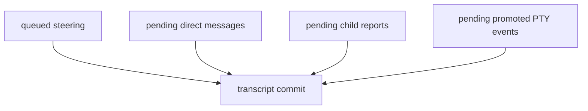

# Transcript And Boundaries

This page explains how the runtime mutates the model-visible transcript and why it does so only at explicit boundaries.

## The Transcript Is Canonical Model Context

`SessionState.transcript` is the runtime's canonical provider-visible conversation state.

That is why the runtime treats transcript mutation carefully:

- not every event belongs there
- not every routed message belongs there
- mutation timing matters

Analogy:

- runtime events are everything happening in the building
- the transcript is the curated briefing packet handed to the model

## Safe-Boundary Injection

The runtime applies certain staged items only when the session is safely idle for transcript mutation.

The main boundary-applied items are:

- queued steering
- pending direct messages
- pending child reports
- pending promoted PTY events

### Boundary Ordering



In the current engine, those are applied before ordinary loop policy.

## Why Not Inject Immediately?

Because immediate mid-phase injection makes the session hard to reason about.

Examples of problems it avoids:

- provider work seeing new runtime-authored messages appear mid-stream
- tools racing with transcript updates
- direct agent messages becoming indistinguishable from model output timing

The runtime chooses coherence over immediacy.

## Runtime-Originated Messages Use Developer Role

The runtime renders safe-boundary injections as `Developer` messages because they are:

- not user-authored
- not assistant-authored
- not raw transport objects

They are runtime-authored context for the model.

### Do Not Confuse

- a PTY event
- a child report
- a direct agent message

with:

- the `Developer` message that the runtime eventually renders from it

The first is the fact. The second is the model-facing representation of that fact.

## Transcript Mutation Surfaces

The runtime has several transcript-related behaviors.

### Ordinary Message Commit

Provider or tool-related message commits append to transcript normally.

### AppendTranscriptMessages

Loop-authored runtime append that safely adds concrete runtime-authored messages.

### RewriteTranscript

Loop-authored full transcript replacement.

### CompactContext

Runtime-backed compaction path used when policy decides the transcript should be shrunk.

## Loop-Authored Transcript Effects

The bounded declarative loop surface includes:

- `RunSubcall`
- `RewriteTranscript`
- `AppendTranscriptMessages`

This is how advanced loop flows are expressed without a control-flow DSL.

Example:

1. loop runs a subcall
2. next tick inspects `last_subcall`
3. loop rewrites or appends transcript
4. runtime records the result in `recent_operations`

## Code Pointers

Key implementation files:

- [`engine.rs`](../../../crates/agent-runtime/src/engine.rs)
- [`session.rs`](../../../crates/agent-runtime/src/session.rs)
- [`loop_strategy.rs`](../../../crates/agent-runtime/src/loop_strategy.rs)

Short runtime snippet:

```rust
if self.apply_pending_direct_messages().await? { continue; }
if self.apply_pending_child_reports().await? { continue; }
if self.apply_pending_promoted_pty_events().await? { continue; }
```

This is the runtime making boundary-safe transcript mutation explicit.

## Child Reports

Child reports are staged in `pending_child_reports` and rendered later.

This keeps the child transport layer separate from transcript mutation.

## Direct Messages

Direct agent messages are stored independently from transcript and only later surfaced if their delivery mode requires it.

That is why "direct" means:

- "surface at next safe boundary"

not:

- "inject immediately right now"

## PTY Event Promotion

PTY events only become transcript-visible when:

1. a subscription matches them
2. delivery mode is `PromoteToDeveloper`
3. the runtime reaches a safe boundary

This keeps PTY observation, PTY subscription, and transcript mutation as three distinct phases.

## Compaction And Doom Loop

Compaction and doom-loop handling are closely related to transcript behavior, but they are not the same thing.

### Context Pressure

Runtime computes `context_pressure` as an advisory.

Loop may react with `CompactContext`.

### Doom Loop

Runtime computes repeated-tool-cycle advice in `doom_loop`.

Loop may respond by queueing steering.

This division is important:

- runtime measures the condition
- loop chooses the policy response

## Related Reading

- [control-flow.md](control-flow.md)
- [messaging.md](messaging.md)
- [pty.md](pty.md)
- [subagents.md](subagents.md)
