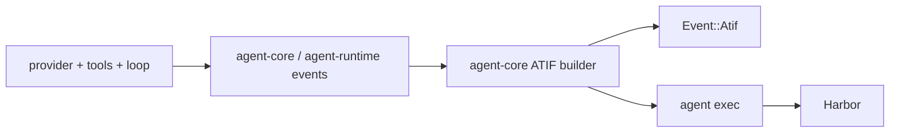

# atif

`atif` is the workspace crate and architecture surface for Harbor-compatible
trajectory export. It is important to read it as an export/interchange layer,
not as the universal in-memory runtime model.

## What ATIF Is In This Repo

| Layer | Meaning |
| --- | --- |
| Runtime events | Live turn activity such as tokens, tool calls, approvals, retries, and `TurnDone` |
| `Event::Atif(...)` | Completion-oriented ATIF events emitted on the runtime stream |
| Persisted trajectory state | Session-scoped ATIF transcript data stored separately and written out by `agent exec` |

## Data Flow

## Ownership

| Component | Responsibility |
| --- | --- |
| `crates/atif` | Rust schema and validation types for Harbor ATIF |
| `agent-runtime` events | Runtime-facing completion and transcript events |
| `agent-store` | Trajectory persistence contract |
| `agent-core` | Append-only trajectory construction and completion-event emission |
| `agent-cli::exec_mode` | Writes benchmark-facing ATIF artifacts |

## Why A Separate Trajectory Store Exists

| Reason | Consequence |
| --- | --- |
| Historical fidelity matters | Old steps should not be regenerated from the latest config |
| Benchmark/export view is not identical to live runtime state | Runtime events stay optimized for interaction while ATIF stays optimized for transcript/export |
| Harbor should consume Rust-emitted truth | The repo does not need to rebuild trajectories in Python |

## Architectural Reading

ATIF is the export boundary that lets the direct `agent` Harbor path stay
native end-to-end. It is a first-class integration concern, but it is still
downstream of the main runtime, not a replacement for it.
