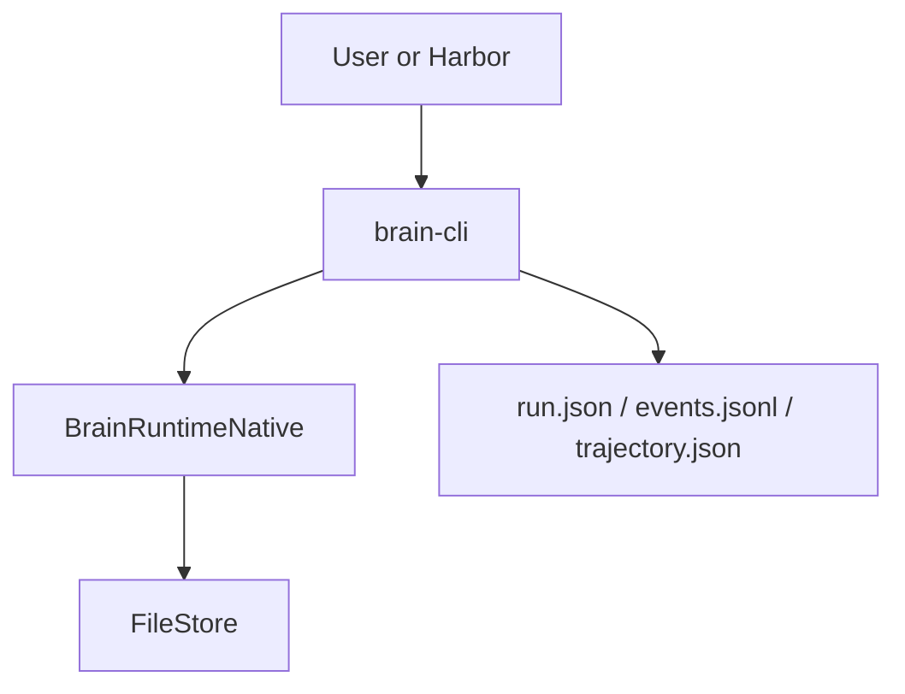

# brain-cli

`brain-cli` is the main local application entrypoint. It bootstraps an embedded
`BrainRuntimeNative`, exposes interactive chat and session management, and also
owns the direct benchmark execution path through `brain exec`.

## Command Surface

| Command | Role |
| --- | --- |
| `brain` | Interactive local chat |
| `brain sessions ...` | Session discovery and resume |
| `brain credentials ...` | Credential management and OAuth login |
| `brain exec ...` | Non-interactive benchmark/harness execution with artifact output |
| `brain acp` | Temporary compatibility alias to launch the ACP stdio surface |

## Runtime Bootstrap

| Step | Behavior |
| --- | --- |
| 1 | Resolve config from defaults, global config, project config, and root `AGENTS.md` |
| 2 | Open a `FileStore` rooted at `brain_home()` |
| 3 | Discover providers from credentials, OAuth, local features, or mock fallback |
| 4 | Register loops: `simple`, `robust`, `terminus2`, `terminus-kira` |
| 5 | Register the native tool suite via `native_tools()` |

## Two Modes

| Mode | What makes it different |
| --- | --- |
| Interactive mode | Uses stored credentials and persistent local state |
| `exec` mode | Accepts explicit auth and output settings for benchmark use; writes `run.json`, `events.jsonl`, and `trajectory.json` |

## CLI In Context

## Architectural Reading

The CLI is no longer a thin demo wrapper. It is both the primary local user
surface and the direct benchmark surface that lets Harbor exercise `brain`
without ACP in the middle.
