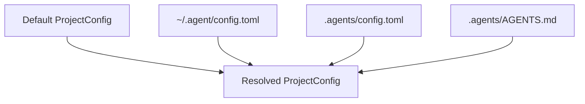

# Config Bootstrap

Current config resolution is an `agent-core` bootstrap concern over the shared
`agent-store::ProjectConfig` model. Legacy `brain-config` code remains in the
repo, but it is no longer the primary architecture boundary.

## Config Layers

| Priority | Source | Purpose |
| --- | --- | --- |
| Lowest | built-in defaults | Safe baseline behavior |
| Middle | `~/.agent/config.toml` when present | User-wide defaults |
| Highest | `.agents/config.toml` discovered from the project root | Project-local runtime policy |

## Prompt Layering

| Source | When it applies |
| --- | --- |
| Explicit config `system_prompt` | Always wins |
| Root `.agents/AGENTS.md` | Used only when config did not already set a prompt |

## What The Crate Resolves

| Concern | Current support |
| --- | --- |
| agent max iterations | yes |
| loop selection | yes |
| provider/model defaults | yes |
| tool output limits and hardening settings | yes |
| compaction and retry settings | yes |
| root and nested `AGENTS.md` discovery helpers | yes |

## Resolution Flow

