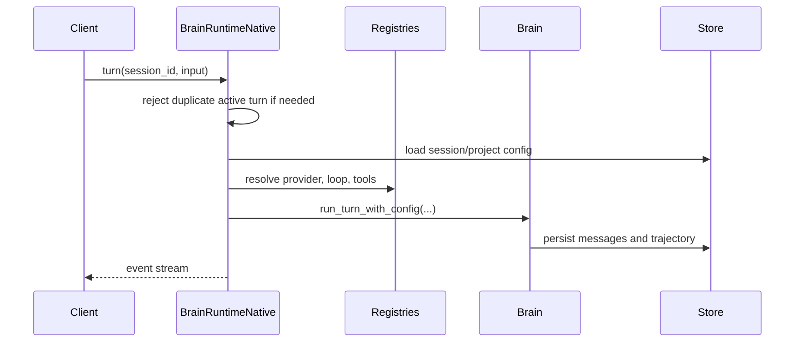

# BrainRuntimeNative

`BrainRuntimeNative` is the current concrete implementation of the
`BrainRuntime` trait. It is the runtime used by `brain-cli` and `brain-acp`.

## Responsibilities

| Area | Current behavior |
| --- | --- |
| Store ownership | Holds one shared `Store` instance |
| Registries | Owns provider, tool, and loop registries |
| Defaults | Tracks default provider name and default loop name |
| Turn lifecycle | Rejects concurrent turns per session and owns cancellation tokens |
| Runtime bus | Publishes duplexed turn events and store lifecycle events |
| Session helpers | Resolves current/effective model and loop state from project + session config |

## Resolution Model

| Concern | Resolution order |
| --- | --- |
| Provider | explicit session/project provider -> unique model owner -> runtime default provider |
| Loop | session loop override -> project loop setting -> runtime default loop |
| Tools | all registered tools |

## Project Bootstrap

When a project root is first resolved, the runtime:

| Step | Behavior |
| --- | --- |
| 1 | normalizes the filesystem root |
| 2 | loads layered config through `brain-config` |
| 3 | uses root `.agents/AGENTS.md` only when config did not already set a prompt |
| 4 | persists the created project through the store |

## Turn Path

## Why It Is Important

`BrainRuntimeNative` is where most local product behavior now comes together.
That is good because it keeps CLI and ACP aligned, but it also means this type
is the main pressure point whenever session controls, capability discovery, or
new runtime-facing semantics are added.
