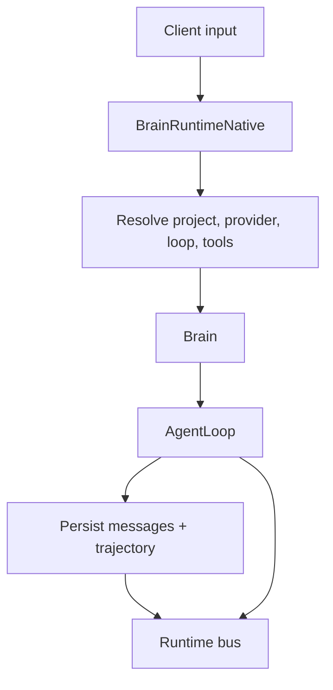

# Core

`brain-core` is the orchestration layer. It contains the reusable engine
(`Brain`), the current concrete app runtime (`BrainRuntimeNative`), and the
crate-level re-export surface that lets higher-level entrypoints bootstrap one
runtime without re-wiring every workspace dependency.

## Table Of Contents

| Topic | Document |
| --- | --- |
| Core overview and runtime contract | [`README.md`](README.md) |
| Current concrete runtime | [`BrainRuntimeNative.md`](BrainRuntimeNative.md) |
| Planned remote runtime shape | [`BrainRuntimeRemote.md`](BrainRuntimeRemote.md) |

## Main Concepts

| Concept | Where it lives | Role |
| --- | --- | --- |
| `Brain` | `brain-core` | Reusable engine for one provider, one loop, one store, and one tool set |
| `BrainRuntime` trait | `brain-types` | App-facing runtime boundary used by CLI and ACP |
| `BrainRuntimeNative` | `brain-core` | Current concrete runtime implementation over registries and a shared store |

## What `BrainRuntime` Means Here

| Trait concern | Why it matters |
| --- | --- |
| `store()` | Keeps raw CRUD available without making the runtime pretend to be the store |
| registries for providers, tools, and loops | Lets app surfaces discover and switch runtime capabilities |
| `turn(...)` and cancellation | Defines the main execution contract shared by CLI and ACP |
| effective config/model helpers | Gives clients a stable way to inspect session state |
| runtime bus subscription | Exposes live runtime activity beyond one client request/response cycle |

## `Brain` vs Runtime

| Type | Responsibility | Use it when |
| --- | --- | --- |
| `Brain` | Execute one turn with concrete dependencies already chosen | You are inside a focused engine path |
| `BrainRuntime` | Expose a full app-facing boundary over projects, sessions, registries, and turns | You are building a client surface |
| `BrainRuntimeNative` | Current implementation of that boundary | You need the actual local runtime |

## Core Flow

## Important Boundaries

| Boundary | Why it exists |
| --- | --- |
| `Brain` vs `BrainRuntime` | Keeps reusable engine logic separate from app/runtime concerns |
| Registry-driven resolution | Lets CLI and ACP use the same runtime while changing provider/loop/tool inventory |
| Store access through runtime | Preserves raw CRUD access without duplicating the whole storage API |
| ATIF builder in core | Keeps export/transcript assembly close to real turn completion semantics |

## Current Pressure Points

| Area | Why it matters |
| --- | --- |
| Runtime scope growth | `BrainRuntimeNative` is becoming the place where more app-facing behavior accumulates |
| Loop diversity | `terminus2` and `terminus-kira` put more strain on the assumption that all loops look alike operationally |
| Event richness | More downstream consumers depend on event ordering and event completeness |
