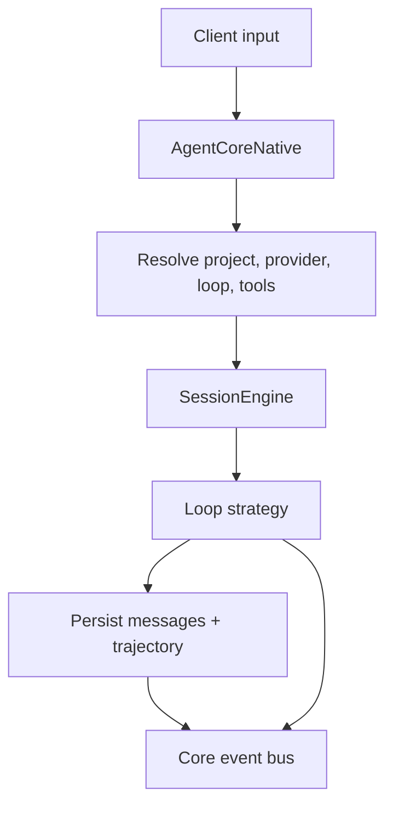

# Core

`agent-core` is the current orchestration layer. It contains the shared
product-facing `AgentCore` boundary plus the concrete local implementation
`AgentCoreNative`. Legacy `brain-core` still exists in the repo, but it is not
the preferred application boundary.

## Table Of Contents

| Topic | Document |
| --- | --- |
| Core overview and runtime contract | [`README.md`](README.md) |
| Current concrete core | [`BrainRuntimeNative.md`](BrainRuntimeNative.md) |
| Planned remote core shape | [`BrainRuntimeRemote.md`](BrainRuntimeRemote.md) |

## Main Concepts

| Concept | Where it lives | Role |
| --- | --- | --- |
| `AgentCore` | `agent-core` | Shared consumer-facing boundary used by CLI, ACP, and server |
| `AgentCoreNative` | `agent-core` | Current concrete local implementation over a store, providers, tools, and loops |
| `SessionEngine` | `agent-runtime` | Reusable live-session engine below the product core |

## What `AgentCore` Means Here

| Trait concern | Why it matters |
| --- | --- |
| `store()` | Keeps raw CRUD available without making the runtime pretend to be the store |
| provider, tool, and loop registration | Lets app surfaces discover and switch runtime capabilities |
| `turn(...)` and cancellation | Defines the main execution contract shared by CLI and ACP |
| effective config/model helpers | Gives clients a stable way to inspect session state |
| core event subscription | Exposes live runtime activity beyond one client request/response cycle |

## `AgentCore` vs Runtime

| Type | Responsibility | Use it when |
| --- | --- | --- |
| `SessionEngine` | Execute one live session with concrete provider/tool/loop choices | You are inside focused runtime mechanics |
| `AgentCore` | Expose the app-facing boundary over projects, sessions, providers, loops, tools, and turns | You are building a client surface |
| `AgentCoreNative` | Current local implementation of that boundary | You need the actual local core |

## Core Flow

## Important Boundaries

| Boundary | Why it exists |
| --- | --- |
| `SessionEngine` vs `AgentCore` | Keeps reusable live-session mechanics separate from app/bootstrap concerns |
| Registry-driven resolution | Lets CLI, ACP, and server use the same core while changing provider/loop/tool inventory |
| Store access through core | Preserves raw CRUD access without duplicating the whole storage API |
| ATIF builder in core | Keeps export/transcript assembly close to real turn completion semantics |

## Current Pressure Points

| Area | Why it matters |
| --- | --- |
| Core scope growth | `AgentCoreNative` is becoming the place where more app-facing behavior accumulates |
| Loop diversity | `terminus2` and `terminus-kira` put more strain on the assumption that all loops look alike operationally |
| Event richness | More downstream consumers depend on event ordering and event completeness |
