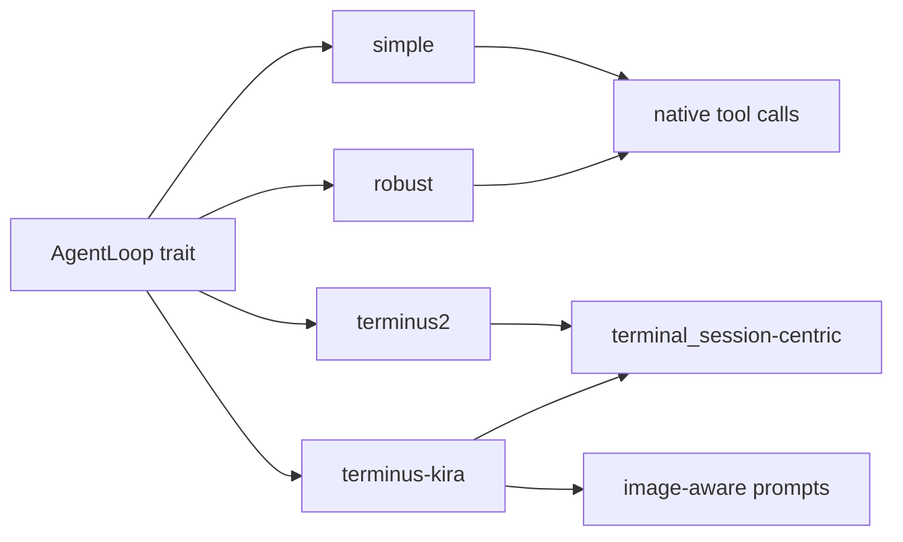

# Loops

`brain-loops` is where the repo's biggest experimental pressure now lives. The
crate keeps agent strategy behind the `AgentLoop` trait, but the concrete loops
now represent meaningfully different execution contracts rather than small
prompt variations.

## Table Of Contents

| Topic | Document |
| --- | --- |
| Loop overview and comparison | [`README.md`](README.md) |
| Baseline loop | [`simple.md`](simple.md) |
| Hardened general-purpose loop | [`robust.md`](robust.md) |
| Harbor-inspired terminal loop | [`terminus2.md`](terminus2.md) |
| KIRA-inspired terminal loop | [`terminus_kira.md`](terminus_kira.md) |

## Loop Inventory

| Loop | Core idea | Tool contract | Best fit today | Notes |
| --- | --- | --- | --- | --- |
| `simple` | Minimal provider -> tool -> re-infer cycle | Native provider tool calls | Baseline local runtime behavior | Smallest mental model |
| `robust` | `simple` plus retries, compaction, and doom-loop detection | Native provider tool calls | Safer general-purpose local loop | Better default than `simple` for real work |
| `terminus2` | Harbor-inspired text-planned terminal loop | Persistent `terminal_session` tool; JSON/text parsing | Benchmark-oriented terminal tasks | Most different from the baseline architecture |
| `terminus-kira` | KIRA-inspired terminal loop with native tool calling and image support | `terminal_session`, optional `shell`, image-aware messages | Benchmark and multimodal terminal tasks | Pushes message/provider/tool surfaces the hardest |

## Comparison Matrix

| Dimension | `simple` | `robust` | `terminus2` | `terminus-kira` |
| --- | --- | --- | --- | --- |
| Provider contract | plain chat + tool calls | plain chat + tool calls | plain chat, parsed structured text | native tool calls + multimodal messages |
| Retry handling | minimal | built-in transient retry events | built-in | built-in |
| Compaction | none | threshold-driven | proactive summarization handoff | none in the same style |
| Doom-loop protection | none | explicit warnings and steering/error behavior | task-completion confirmation and terminal-state steering | completion confirmation plus stricter task finish loop |
| Terminal awareness | none | none | central | central |
| Benchmark influence | low | medium | high | high |

## Execution Shape

## Architectural Reading

| Observation | Why it matters |
| --- | --- |
| The crate is still successfully isolating loop experimentation from `brain-core` | This is the main reason the recent benchmark-driven work has not forced a deeper runtime rewrite yet |
| `terminus2` and `terminus-kira` are not just hardened variants of `simple` | They encode different assumptions about planning, terminal feedback, and completion confirmation |
| Persistent terminal sessions are now a first-class loop primitive | Tooling and events need to support long-lived execution state rather than only one-shot tools |
| Multimodality entered through loop pressure, not only provider pressure | The message model and OpenAI-compatible serializers had to widen because KIRA-style behavior needed them |

## Practical Guidance

| If you are working on... | Start with |
| --- | --- |
| default interactive behavior | [`robust.md`](robust.md) |
| benchmark parity work | [`terminus2.md`](terminus2.md) and [`terminus_kira.md`](terminus_kira.md) |
| event-model changes | confirm impact across all four loops |
| tool-surface changes | validate against persistent terminal-session semantics, not only one-shot tools |
