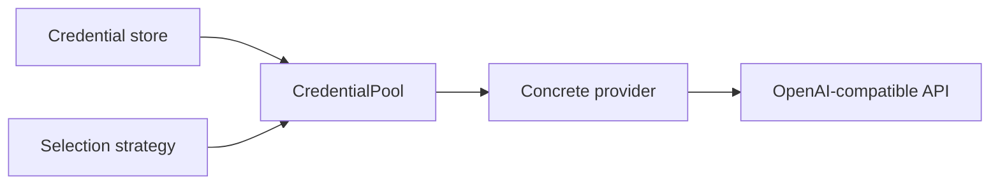
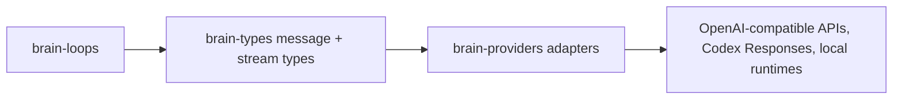

# Providers

`brain-providers` contains the inference backends plus the credential routing,
selection strategy, preset metadata, and wire-format adaptation that those
backends depend on.

## Table Of Contents

| Topic | Document |
| --- | --- |
| Provider overview | [`README.md`](README.md) |
| OpenAI-compatible provider family | [`openai.md`](openai.md) |
| OAuth-backed OpenAI provider | [`openai_oauth.md`](openai_oauth.md) |
| Local `mistralrs` provider | [`mistralrs.md`](mistralrs.md) |
| Local `llama.cpp` provider | [`llamacpp.md`](llamacpp.md) |

## Provider Families

| Family | What it covers | Notes |
| --- | --- | --- |
| `mock` | Deterministic local echo/testing provider | Always available baseline |
| `openai` | OpenAI-compatible HTTP providers and presets | Broadest external-provider path |
| `openai-oauth` | OAuth-backed OpenAI path | Builds on stored or pooled OAuth credentials |
| `mistralrs` | In-process local inference via `mistralrs` | Feature-gated |
| `llamacpp` | In-process local inference via `llama.cpp` | Feature-gated |
| `pool` | CredentialPool and credential resolution/refresh | Shared auth substrate |
| `strategy` | `Fallback` and `StickyRoundRobin` selection policies | Used by pooled providers |

## What This Crate Actually Owns

| Concern | Current role |
| --- | --- |
| Provider implementations | yes |
| Provider metadata and model lists | yes |
| Preset catalogs for OpenAI-compatible vendors | yes |
| API-key and OAuth credential routing | yes |
| Local model provider configs | yes |

## Shared Runtime Contract

The provider boundary in `brain` is intentionally small, but it is no longer
just "send text to an API."

| Shared type | Why it matters |
| --- | --- |
| `Provider::chat(messages, tools, config, session_id)` | One entrypoint for all inference, including multimodal turns |
| `ChatStream` / `ChatChunk` | Streaming is the default contract, not an optional add-on |
| `MessageContent::{Text, Parts}` | Multimodality enters through the shared message model |
| `ContentPart::{Text, ImageUrl}` | Current multimodal support is text plus image URLs/data URLs |
| `ModelInfo` | Model capability metadata travels alongside provider listings |

## Credential Path

## Provider Boundary And Loop Pressure

## Architectural Reading

| Observation | Why it matters |
| --- | --- |
| The provider contract is message-first and stream-first | Loops call one `chat(...)` entrypoint and always consume a stream |
| OpenAI-compatible coverage is the broadest path | The repo is using that surface as the main external-provider compatibility layer |
| The trait is broader than one wire protocol | The same boundary also adapts Codex Responses plus local providers such as `mistralrs` and `llama.cpp` |
| Multimodality entered through `MessageContent::Parts` | The recent widening happened in shared message types, not by adding a second provider API |
| Loop pressure is what widened this seam recently | `terminus_kira` forced image-aware prompts and serializer changes across the provider layer |
| Pooling and selection strategy are reusable seams | Credential handling is not hardcoded into one provider instance |

## Related Reading

| Topic | Document |
| --- | --- |
| Cross-cutting provider-trait research | [`../../research/competitors/provider.md`](../../research/competitors/provider.md) |
| Loop overview and pressure points | [`../loops/README.md`](../loops/README.md) |
| Shared type definitions | [`../types.md`](../types.md) |
