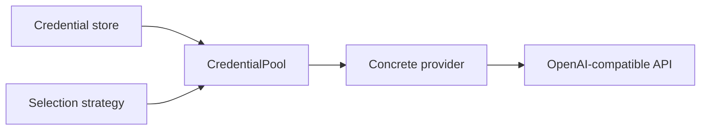

# Providers

`brain-providers` contains the inference backends plus the credential routing,
selection strategy, and preset metadata that those backends depend on.

## Table Of Contents

| Topic | Document |
| --- | --- |
| Provider overview | [`README.md`](README.md) |
| OpenAI-compatible provider family | [`openai.md`](openai.md) |
| OAuth-backed OpenAI provider | [`openai_oauth.md`](openai_oauth.md) |
| Local `mistralrs` provider | [`mistralrs.md`](mistralrs.md) |
| Local `llama.cpp` provider | [`llamacpp.md`](llamacpp.md) |

## Provider Families

| Family | What it covers | Notes |
| --- | --- | --- |
| `mock` | Deterministic local echo/testing provider | Always available baseline |
| `openai` | OpenAI-compatible HTTP providers and presets | Broadest external-provider path |
| `openai-oauth` | OAuth-backed OpenAI path | Builds on stored or pooled OAuth credentials |
| `mistralrs` | In-process local inference via `mistralrs` | Feature-gated |
| `llamacpp` | In-process local inference via `llama.cpp` | Feature-gated |
| `pool` | CredentialPool and credential resolution/refresh | Shared auth substrate |
| `strategy` | `Fallback` and `StickyRoundRobin` selection policies | Used by pooled providers |

## What This Crate Actually Owns

| Concern | Current role |
| --- | --- |
| Provider implementations | yes |
| Provider metadata and model lists | yes |
| Preset catalogs for OpenAI-compatible vendors | yes |
| API-key and OAuth credential routing | yes |
| Local model provider configs | yes |

## Credential Path

## Architectural Reading

| Observation | Why it matters |
| --- | --- |
| Provider logic is not only about HTTP transport anymore | Auth, preset metadata, and model-discovery behavior all affect runtime architecture |
| OpenAI-compatible coverage is the broadest path | The repo is using that surface as the main external-provider compatibility layer |
| Multimodal pressure changed serializer behavior | Message parts and image URLs now matter at the provider boundary, not only in loops |
| Pooling and selection strategy are reusable seams | Credential handling is not hardcoded into one provider instance |
