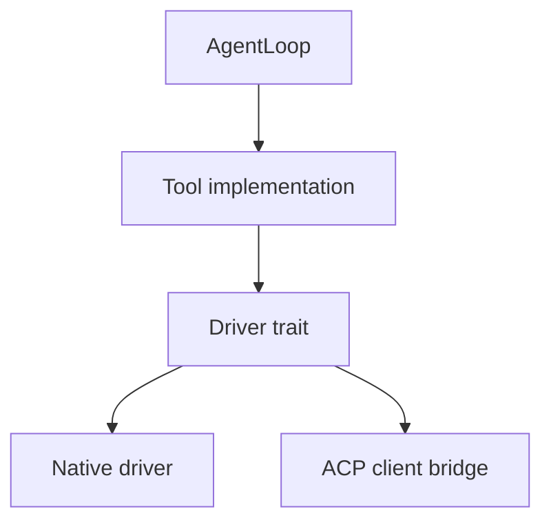

# Tools

The tool layer is now split between `agent-tool`, which owns the shared tool
SDK and erased runtime-facing executor contract, and first-party `agent-tool-*`
family crates that implement concrete tool packs. This keeps the execution
boundary stable while file, process, and future web capabilities evolve
independently.

## Table Of Contents

| Tool | Document |
| --- | --- |
| Overview | [`README.md`](README.md) |
| `agent-tool` / `echo` | [`echo.md`](echo.md) |
| `file_read` | [`file_read.md`](file_read.md) |
| `file_write` | [`file_write.md`](file_write.md) |
| `file_edit` | [`file_edit.md`](file_edit.md) |
| `apply_patch` | [`apply_patch.md`](apply_patch.md) |
| `list_directory` | [`list_directory.md`](list_directory.md) |
| `glob_search` | [`glob_search.md`](glob_search.md) |
| `grep` | [`grep.md`](grep.md) |
| `shell` | [`shell.md`](shell.md) |
| `terminal_session` | [`terminal_session.md`](terminal_session.md) |

## Tool Surface

| Tool | Main purpose | Backend style |
| --- | --- | --- |
| `echo` | Small test/debug tool in `agent-tool` | Direct implementation |
| `file_read` | Read file contents with offset/limit controls | Native and ACP-backed variants |
| `file_write` | Create or overwrite files | Native and ACP-backed variants |
| `file_edit` | Single-match replacement edits | Native |
| `apply_patch` | V4A patch application | Native |
| `list_directory` | Tree-like directory listing | Native |
| `glob_search` | File pattern search | Native |
| `grep` | Regex content search | Native |
| `shell` | One-shot shell command execution in `agent-tool-process` | Native |

## Pattern

| Layer | Responsibility |
| --- | --- |
| `agent-tool` SDK | Shared `ToolExecutor`, tool call/result envelopes, and standard registry |
| `Tool` implementation | Advertise schema and validate arguments |
| Driver trait | Define the execution contract for a family of tools |
| Native / ACP driver | Perform the actual filesystem, shell, or client-bridge work |

## Adapter Model

## Why This Matters

| Theme | Current implication |
| --- | --- |
| Stable schemas | Providers and loops can continue to refer to one tool name even if the execution backend changes |
| ACP compatibility | File reads and writes can be routed into client-managed workspaces instead of only the backend host filesystem |
| Persistent terminal state | `terminal_session` enables Terminus-style loops without hardcoding shell state into `agent-core` or `agent-runtime` |
| Native editing | `apply_patch` and edit/file tools give the direct runtime a real local mutation surface |

## Runtime Default Surface

The native core bootstrap now composes the shared `agent-tool` SDK registry
with the native tool-family helpers from `agent-tool-files` and
`agent-tool-process`. That gives `agent-cli` and direct Harbor runs one
consistent baseline tool inventory without requiring a monolithic `agent-tools`
crate.
