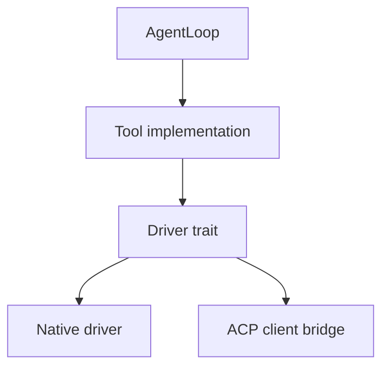

# Tools

`brain-tools` packages the runtime capabilities that loops can invoke. The
crate uses a driver-and-adapter pattern so the tool contract stays stable while
execution moves between native Rust implementations and ACP-backed client-owned
operations.

## Table Of Contents

| Tool | Document |
| --- | --- |
| Overview | [`README.md`](README.md) |
| `echo` | [`echo.md`](echo.md) |
| `file_read` | [`file_read.md`](file_read.md) |
| `file_write` | [`file_write.md`](file_write.md) |
| `file_edit` | [`file_edit.md`](file_edit.md) |
| `apply_patch` | [`apply_patch.md`](apply_patch.md) |
| `list_directory` | [`list_directory.md`](list_directory.md) |
| `glob_search` | [`glob_search.md`](glob_search.md) |
| `grep` | [`grep.md`](grep.md) |
| `shell` | [`shell.md`](shell.md) |
| `terminal_session` | [`terminal_session.md`](terminal_session.md) |

## Tool Surface

| Tool | Main purpose | Backend style |
| --- | --- | --- |
| `echo` | Small test/debug tool | Direct implementation |
| `file_read` | Read file contents with offset/limit controls | Native and ACP-backed variants |
| `file_write` | Create or overwrite files | Native and ACP-backed variants |
| `file_edit` | Single-match replacement edits | Native |
| `apply_patch` | V4A patch application | Native |
| `list_directory` | Tree-like directory listing | Native |
| `glob_search` | File pattern search | Native |
| `grep` | Regex content search | Native |
| `shell` | One-shot shell command execution | Native |
| `terminal_session` | Persistent interactive terminal session | Native |

## Pattern

| Layer | Responsibility |
| --- | --- |
| `Tool` implementation | Advertise schema and validate arguments |
| Driver trait | Define the execution contract for a family of tools |
| Native / ACP driver | Perform the actual filesystem, shell, or client-bridge work |

## Adapter Model

## Why This Matters

| Theme | Current implication |
| --- | --- |
| Stable schemas | Providers and loops can continue to refer to one tool name even if the execution backend changes |
| ACP compatibility | File reads and writes can be routed into client-managed workspaces instead of only the backend host filesystem |
| Persistent terminal state | `terminal_session` enables Terminus-style loops without hardcoding shell state into `brain-core` |
| Native editing | `apply_patch` and edit/file tools give the direct runtime a real local mutation surface |

## Runtime Default Surface

`native_tools()` is the preset that registers the common local tool suite for
the CLI and native runtime bootstrap. That gives `brain-cli` and direct Harbor
runs one consistent baseline tool inventory.
