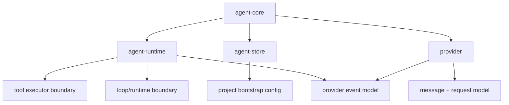

# Shared Contracts

The current shared contracts are no longer concentrated in one `brain-*`
crate. They are primarily split across `provider`, `agent-runtime`, and
`agent-store`.

## Responsibilities

| Area | Main types | Why it matters |
| --- | --- | --- |
| Inference contract | `provider::{Provider, Request, Message, ToolDefinition, ProviderInfo}` | Keeps model backends swappable |
| Runtime contract | `agent-runtime::{SessionEngine, RuntimeEvent, LoopStrategy}` | Separates live execution mechanics from product orchestration |
| Tool contract | `agent-runtime::ToolExecutor` plus `agent-tools` typed contracts | Decouples loop policy from tool implementation |
| Persistence contract | `agent-store::{Store, ProjectStore, SessionStore, MessageStore, CredentialStore, TrajectoryStore}` | Keeps durable state ownership out of the loop implementation |
| Application boundary | `agent-core::AgentCore` | Gives CLI, ACP, and server one shared consumer surface |
| Configuration model | `agent-store::ProjectConfig` and `agent-runtime::RuntimeConfig` | Carries bootstrap and live runtime settings |

## Key Design Choices

| Choice | What the code does today | Implication |
| --- | --- | --- |
| Traits over class hierarchies | All core seams are Rust traits | Concrete crates stay replaceable |
| Composed store surface | `agent-store::Store` exposes domain-specific sub-stores | Core callers can use high-level APIs without hiding raw state access |
| Rich event model | `RuntimeEvent` and provider block events carry tokens, tool lifecycle, approvals, PTY activity, and ATIF-relevant facts | UI surfaces and benchmark/export surfaces can observe the same turn stream |
| Multimodal message content | `provider::Message` and block/content types are structured first-class types | Provider and loop work can handle image-augmented turns without ad hoc side channels |
| Core distinct from store | `AgentCore` exposes store access instead of pretending the core is the store | App surfaces can keep CRUD and orchestration concerns separate |

## Relationship Map

## Places To Watch

| Topic | Why it is notable right now |
| --- | --- |
| Message content | Multimodal support widened the message contract beyond plain text |
| Event surface | More loop/runtime state is being communicated through `RuntimeEvent` and provider block events |
| Session overrides | Model and loop selection now sit partly at session scope |
| Trajectory persistence | ATIF adds a second transcript-shaped persistence concern beside messages |
