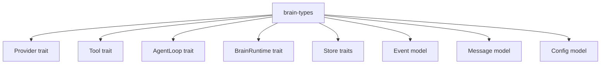

# brain-types

`brain-types` is the contract crate for the workspace. It is where the system
decides what a provider, tool, store, transport, loop, runtime, message, and
event actually are before any concrete crate chooses how to implement them.

## Responsibilities

| Area | Main types | Why it matters |
| --- | --- | --- |
| Inference contract | `Provider`, `ChatStream`, `ChatChunk`, `ProviderInfo` | Keeps model backends swappable |
| Tool contract | `Tool`, `ToolDef`, `ToolCall` | Decouples loop policy from tool implementation |
| Loop contract | `AgentLoop`, `EventStream` | Lets loop strategy evolve independently |
| Runtime contract | `BrainRuntime`, `RuntimeBusEvent` | Gives CLI and ACP a shared app-facing boundary |
| Persistence contract | `CrudStore`, `Store`, domain stores, store events | Keeps state ownership out of the loop implementation |
| Conversation model | `Message`, `MessageContent`, `ContentPart`, `Session`, `Project` | Defines what flows through providers and stores |
| Configuration model | `AgentConfig`, `InferenceConfig`, `AtifConfig` | Carries runtime, loop, and export settings |

## Key Design Choices

| Choice | What the code does today | Implication |
| --- | --- | --- |
| Traits over class hierarchies | All core seams are Rust traits | Concrete crates stay replaceable |
| Composed store surface | `Store` exposes sub-stores instead of inheriting every CRUD trait directly | Runtime callers can use high-level APIs without hiding raw state access |
| Rich event model | `Event` includes tokens, tool lifecycle, approvals, progress, retries, compaction, doom-loop warnings, and ATIF events | UI surfaces and benchmark/export surfaces can observe the same turn stream |
| Multimodal message content | `MessageContent` can be plain text or `Parts`, and `ContentPart` includes `Text` plus `ImageUrl` | Provider and loop work can handle image-augmented turns without ad hoc side channels |
| Runtime distinct from store | `BrainRuntime` exposes `store()` instead of pretending the runtime is the store | App surfaces can keep CRUD and orchestration concerns separate |

## Relationship Map

## Places To Watch

| Topic | Why it is notable right now |
| --- | --- |
| Message content | Multimodal support widened the message contract beyond plain text |
| Event surface | More loop/runtime state is being communicated through events |
| Session overrides | Model and loop selection now sit partly at session scope |
| Trajectory persistence | ATIF adds a second transcript-shaped persistence concern beside messages |
