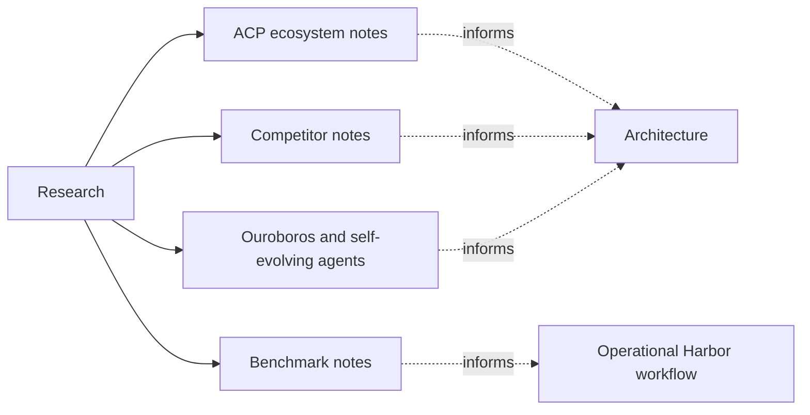

# Research Docs

These docs are intentionally separated from the architecture set. They are
source-first working notes used to evaluate external protocols, benchmarks, and
adjacent systems without implying that every conclusion here is already part of
the current `brain` architecture.

## Research Areas

| Area | Scope | Primary question |
| --- | --- | --- |
| [`acp/README.md`](acp/README.md) | Agent Client Protocol, client ecosystem, registry, adapters, and client UX implications | How should `brain` participate in ACP without collapsing runtime and UI concerns? |
| [`benchmarks/README.md`](benchmarks/README.md) | Harbor, Terminal-Bench, SWE-bench, HAL, Terminus, and evaluation methodology | How should `brain` compare loops and harnesses fairly? |
| [`competitors/README.md`](competitors/README.md) | Source-first analysis of adjacent products and SDKs | Which architectural patterns are worth borrowing or explicitly rejecting? |
| [`ouroboros/README.md`](ouroboros/README.md) | Self-evolving autonomous-agent research spanning continuity, migration, governance, and capability growth | What would it take to move from a self-modifying agent PoC to a durable distributed autonomous institution? |

## How To Use This Section

| If you need... | Start here |
| --- | --- |
| the current crate boundaries | [`../architecture/README.md`](../architecture/README.md) |
| ACP direction and client research | [`acp/README.md`](acp/README.md) |
| benchmark strategy or Harbor framing | [`benchmarks/README.md`](benchmarks/README.md) |
| competitor patterns and external comparisons | [`competitors/README.md`](competitors/README.md) |
| self-evolving agent concepts, lineage, and distributed autonomy questions | [`ouroboros/README.md`](ouroboros/README.md) |

## Position In The Repo

