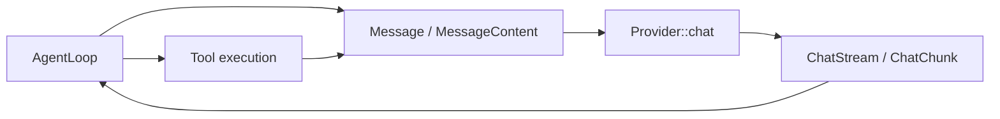
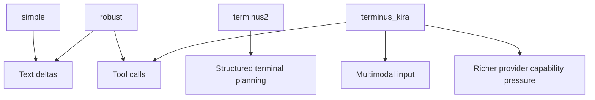

# Provider Abstraction Research

This page analyzes `crates/brain-types/src/provider.rs` as a cross-cutting seam
between provider adapters, model metadata, and agent loops. The question is not
whether the current trait is "good" in the abstract. The question is whether it
is a strong enough boundary for the loops and provider families this repo is
actually building now.

## Executive Summary

| Question | Assessment |
| --- | --- |
| Is the current `Provider` trait message-first? | Yes. The main abstraction is `chat(messages, tools, config, session_id)`, and multimodality now rides inside `Message` rather than through a separate provider API. |
| Is it stream-first? | Yes. The trait only exposes streaming through `ChatStream`, which keeps loops responsive and avoids a parallel non-streaming surface. |
| Did multimodality fit the current boundary? | Mostly yes on input. `MessageContent::Parts` and `ContentPart::{Text, ImageUrl}` were enough to support `terminus_kira` without inventing a second provider contract. |
| Is it well suited for streaming? | Partially. It handles text deltas, tool-call deltas, final tool calls, and usage, but it is thinner than the richer event models used by Codex, Cline, pi-mono, or Vercel AI SDK. |
| Where is the main pressure? | The pressure is at the interaction between loops and providers. `simple` and `robust` fit the current trait well. `terminus_kira` already proves that multimodal turns and loop-specific behavior widen the boundary. |
| Is capability knowledge explicit enough? | Only partly. `ModelInfo` already carries useful modality and feature metadata, but runtime decisions still depend heavily on provider-specific adapters and presets. |

## `brain` Baseline

### Current Contract

| Surface | Current shape | What it buys |
| --- | --- | --- |
| Provider entrypoint | `Provider::chat(messages, tools, config, session_id)` | One inference path for text-only and multimodal loops |
| Streaming output | `ChatStream = Stream<Item = Result<ChatChunk, BrainError>>` | Provider backends can start emitting deltas immediately |
| Stream event model | `Delta`, `ToolCallDelta`, `ToolCall`, `Done { usage }` | Enough for text streaming plus native tool calls |
| Input message model | `MessageContent::{Text, Parts}` | Multimodal user turns fit the existing message type |
| Content parts | `ContentPart::{Text, ImageUrl}` | `terminus_kira` can send image-augmented prompts without a side channel |
| Capability metadata | `ModelInfo` with `tool_call`, `attachment`, `reasoning`, `input_modalities`, `output_modalities` | Some loop/provider decisions can be data-driven already |

### Why The Boundary Changed Recently

`brain` did not widen its provider boundary because providers suddenly became
more complicated in isolation. The widening came from loop pressure. In
`terminus_kira`, the loop now needs to read an image, turn it into a data URL,
and send a multimodal user message through the same provider interface that
`simple`, `robust`, and `terminus2` already use.

### Current Reading

| Observation | Why it matters |
| --- | --- |
| Multimodality entered through `Message`, not a second provider trait | This preserved one shared loop-provider boundary |
| The trait is normalized around chat-style interactions | Adapters can target OpenAI-compatible APIs while still supporting other backends |
| The stream is already the primary contract | Loops do not have to special-case "streaming providers" and "non-streaming providers" |
| The trait stays intentionally small | Adapter code stays local to provider crates instead of leaking wire-protocol details upward |

## Comparison Matrix

| System | Abstraction shape | Streaming shape | Multimodal fit | Tool-call fit | Capability discovery | Adapter burden |
| --- | --- | --- | --- | --- | --- | --- |
| `brain` | One `chat(...)` trait over rich `Message` values | `ChatChunk` with text, tool deltas, final calls, done | Good for input, thin for non-text outputs | Good for current native tool-call path | Moderate via `ModelInfo`, still partly implicit | Moderate and growing |
| Codex | Product runtime over provider/client subsystems | Rich `ResponseEvent` stream | Strong on structured multimodal items | Strong, first-class, partially parallel | Strong model metadata and runtime capability logic | High, hidden inside product runtime |
| OpenCode | Provider registry over AI SDK adapters | Rich event stream from `streamText(...)` | Strong via provider transforms and provider-specific APIs | Strong, event-fed | Mixed between registry data and transforms | High, especially across `chat` vs `responses` vs `languageModel` paths |
| Cline | Large provider handler registry | Text, reasoning, usage, and tool-call deltas | Practical, provider-specific | Strong native tool-use streaming | Mixed, heavily handler-specific | High |
| pi-mono | Provider stream functions over a rich message model | Very rich event protocol | Strong on both input and tool-result content | Strong, explicit stream events | Moderate, plus provider/model registries | Moderate to high |
| ZeroClaw | Trait-driven provider layer | Text-only chunk stream plus separate response structures | Weak on multimodal input | Good for tool-call text flows | Better than `brain` on explicit capabilities | Moderate |
| Vercel AI SDK | Model-family provider interfaces | Separate `doGenerate()` and `doStream()` contracts | Very strong, including supported URL metadata | Very strong | Strong, interface-level | High inside providers, low for callers |
| `async-openai` | Protocol SDK | Protocol-native SSE/realtime events | Strong at protocol layer | Strong at protocol layer | Strong for OpenAI protocol, narrow beyond that | Low as SDK, high if used as runtime abstraction |
| Rig | Library-first provider and tool abstractions | Good provider/request streaming | Better than `brain` on library composition, less coding-agent specific | Strong | Good provider/client composition | Moderate |

## Agent Runtime Comparisons

### Competitor Agents

| Project | Most relevant lesson for `brain`'s provider trait |
| --- | --- |
| Codex | The stream is not just text. A mature coding-agent runtime eventually wants reasoning deltas, completion items, rate-limit state, and transport fallback signals. |
| OpenCode | Provider abstraction often becomes adapter orchestration rather than one trait method because real systems bridge `responses`, `chat`, and language-model SDKs at once. |
| Cline | Broad provider support creates pressure for provider-specific stream normalization, especially around reasoning deltas and tool-call partials. |
| pi-mono | A single message model can carry multimodal user input and image-bearing tool results, while the stream remains richly evented. |
| ZeroClaw | A Rust trait can stay simple while still exposing explicit provider capabilities, but a text-only message model becomes a hard ceiling quickly. |

### Provider SDKs

| SDK | Most relevant lesson for `brain` |
| --- | --- |
| Vercel AI SDK | Strongest reference for splitting provider families cleanly and treating streaming as a first-class model operation rather than a boolean option. |
| `async-openai` | Best reference for raw protocol coverage, hosted-tool schemas, and the event complexity hiding under OpenAI-compatible surfaces. |
| Rig | Good reference for a library-grade provider boundary that composes with tools and other subsystems without turning into a product monolith. |

## Multimodality Analysis

### What Changed In `brain`

| Area | Current state |
| --- | --- |
| Input shape | `MessageContent::Parts(Vec<ContentPart>)` carries mixed text and image URLs |
| Supported parts | `Text` and `ImageUrl` |
| Main motivating loop | `terminus_kira` |
| Provider adaptation | OpenAI-compatible serializers and Codex Responses serializers now map message parts into provider-native payloads |
| Capability metadata | `ModelInfo.input_modalities` and `ModelInfo.output_modalities` already advertise model-level support |

### Assessment

The recent multimodal change was directionally correct. It kept the provider
trait stable while widening the shared message model. That is a good sign
because it means multimodal input was a message-shape problem first, not a
second inference-API problem.

The main limitation is that the current widening is input-heavy. `brain` can
send multimodal turns, but the normalized output contract is still largely
text-and-tool oriented. If future loops need image output, audio output,
provider-side annotations, or richer reasoning blocks, the current stream shape
will become the bottleneck before the trait method signature does.

## Streaming Analysis

### Is The Trait Well Suited For Streaming?

| Aspect | Assessment |
| --- | --- |
| Text token streaming | Strong |
| Tool-call partial streaming | Strong enough for current OpenAI-style tool calls |
| Final usage reporting | Strong enough |
| Reasoning delta streaming | Weak |
| Non-text output streaming | Weak |
| Provider-native event passthrough | Weak by design |
| Retry and transport-state signaling | Weak |

### Reading The Current `ChatChunk` Model

| Chunk | Good fit today | Missing pressure |
| --- | --- | --- |
| `Delta { content }` | Standard token streaming | Cannot distinguish visible text from reasoning or other semantic channels |
| `ToolCallDelta { ... }` | OpenAI-style incremental function-call assembly | Assumes one main kind of structured partial event |
| `ToolCall { ... }` | Finalized native tool call | Good for current loops |
| `Done { usage }` | Stream completion and usage snapshot | No room for richer final metadata beyond usage |

The important conclusion is that `brain` is already stream-first, but the
stream is intentionally normalized to a narrow event family. That is a good fit
for `simple`, `robust`, and the current `terminus_kira`, but it is not yet as
expressive as the event models used by Codex, Cline, pi-mono, or Vercel AI SDK.

## Provider And Loop Interaction

The provider trait should not be judged in isolation because the loops are the
real consumers of the abstraction.

| Loop | How it uses the provider seam | Pressure on the trait |
| --- | --- | --- |
| `simple` | Straight provider -> tool call -> provider cycle | Low |
| `robust` | Same shape as `simple`, plus retry and compaction concerns around the loop | Low to medium |
| `terminus2` | Uses the provider as a text-planning engine around `terminal_session` | Medium, but mostly text-oriented |
| `terminus_kira` | Uses native tool calls, stricter completion steering, and multimodal messages | High |

### Loop Pressure Map

### Interaction Reading

| Observation | Why it matters |
| --- | --- |
| `simple` and `robust` validate the current normalization | They mostly need text, tool calls, and usage |
| `terminus2` proves that not every advanced loop needs a richer provider trait | It pushes loop logic more than provider semantics |
| `terminus_kira` is the real boundary test | It proves multimodality can fit the current trait, but only because `Message` got richer |
| Future loop work will likely widen stream semantics before method semantics | The main missing pieces are event richness and explicit capability signaling |

## Capability Discovery And Adapter Burden

### What Is Explicit Today

| Explicit in shared types | Still implicit or provider-local |
| --- | --- |
| `ModelInfo.reasoning` | Provider-specific request shaping |
| `ModelInfo.tool_call` | Wire-protocol quirks and serializer branches |
| `ModelInfo.attachment` | Which providers actually accept which content-part shapes |
| `ModelInfo.input_modalities` | Stream-event richness beyond text/tool calls |
| `ModelInfo.output_modalities` | Retry, transport, and partial capability fallbacks |

### Assessment

`brain` is in a workable middle ground. It is better than a pure text-only
trait because it already carries rich model metadata and multimodal messages.
It is weaker than systems like ZeroClaw or Vercel AI SDK on explicit capability
surfacing because many important runtime facts still live in adapter logic,
preset catalogs, or loop assumptions rather than in the trait itself.

This matters most when supporting providers that are OpenAI-like but not
actually equivalent. The main provider surface in the repo is still
OpenAI-compatible, but the adaptation burden already includes Codex Responses,
OpenAI OAuth flows, `mistralrs`, `llama.cpp`, and local-vs-remote capability
differences. That burden grows when loops assume more than "text plus one tool
call style."

## Assessment Of The Current Trait

### What It Already Does Well

| Strength | Why it is meaningful |
| --- | --- |
| One provider entrypoint | Keeps loops and `brain-core` simple |
| Message-first multimodality | Avoided a second provider API for `terminus_kira` |
| Stream-first contract | Matches real coding-agent UX and loop needs better than request/response-only APIs |
| Small normalized event set | Makes provider adapters easier to consume from loops |
| Model metadata already exists | Future capability-aware routing does not need to start from zero |

### Where It Is Thin

| Pressure point | Why it matters |
| --- | --- |
| No explicit provider capability interface | Capability knowledge stays partly hidden in adapters and presets |
| Narrow `ChatChunk` model | Richer reasoning, multimodal output, annotations, or approval events do not fit naturally |
| Output contract is less multimodal than the input contract | The system can send richer user messages than it can receive back in normalized form |
| Streaming semantics are loop-friendly but not SDK-rich | Fine for current loops, less strong for future event-heavy runtimes |
| The trait relies on `Message` being richer than the trait advertises | The method signature looks simple, but most real expressiveness lives in shared message and model types |

### Working Conclusion

The current `Provider` trait is a good local maximum for the repo's present
shape. It is small, reusable, and already proved flexible enough to absorb the
recent multimodal change for `terminus_kira`.

It is not, however, the final form of the boundary. The main issue is not that
`chat(...)` needs to split into multiple methods right now. The main issue is
that the normalized stream and capability story are thinner than the loops and
provider adapters are becoming. If a future refactor happens, the strongest
pressure signal is likely to come from richer stream events and more explicit
capability metadata, not from abandoning the message-first provider entrypoint.

## Related Architecture Docs

| Topic | Document |
| --- | --- |
| Provider overview | [`../../architecture/provider/README.md`](../../architecture/provider/README.md) |
| Loop overview | [`../../architecture/loops/README.md`](../../architecture/loops/README.md) |
| Shared type system | [`../../architecture/types.md`](../../architecture/types.md) |
| Loop-design benchmark notes | [`../benchmarks/LoopDesign.md`](../benchmarks/LoopDesign.md) |

## Key Evidence

- `crates/brain-types/src/provider.rs`
- `crates/brain-types/src/message.rs`
- `crates/brain-types/src/stream.rs`
- `crates/brain-types/src/model.rs`
- `crates/brain-loops/src/simple.rs`
- `crates/brain-loops/src/robust.rs`
- `crates/brain-loops/src/terminus2.rs`
- `crates/brain-loops/src/terminus_kira.rs`
- `crates/brain-providers/src/openai_sse.rs`
- `crates/brain-providers/src/codex_sse.rs`
- `repocache/vercel/ai/packages/provider/src/provider/v4/provider-v4.ts`
- `repocache/vercel/ai/packages/provider/src/language-model/v4/language-model-v4.ts`
- `repocache/badlogic/pi-mono/packages/ai/src/types.ts`
- `repocache/badlogic/pi-mono/packages/ai/src/providers/openai-codex-responses.ts`
- `repocache/cline/cline/src/core/api/index.ts`
- `repocache/cline/cline/src/core/api/providers/openai.ts`
- `repocache/anomalyco/opencode/packages/opencode/src/provider/provider.ts`
- `repocache/zeroclaw-labs/zeroclaw/src/providers/traits.rs`
- `repocache/64bit/async-openai/async-openai/src/client.rs`
- `repocache/64bit/async-openai/async-openai/src/types/responses/stream.rs`
- `repocache/0xPlaygrounds/rig/rig/rig-core/src/providers/mod.rs`
- `repocache/0xPlaygrounds/rig/rig/rig-core/src/agent/completion.rs`
