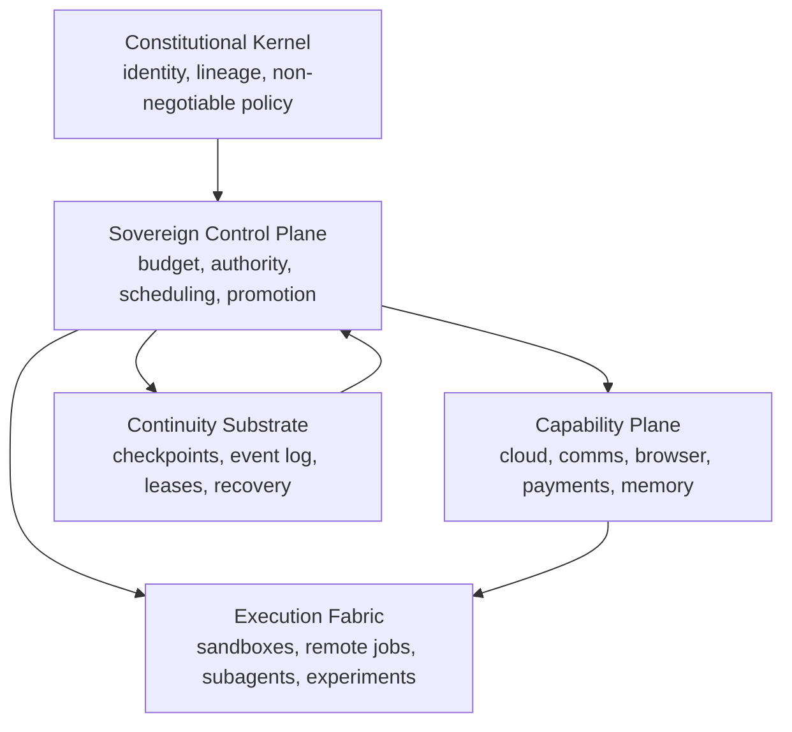
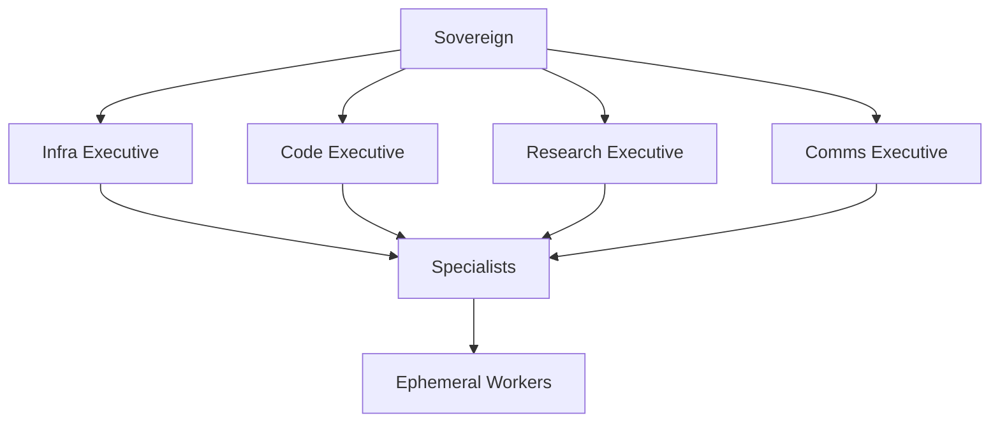
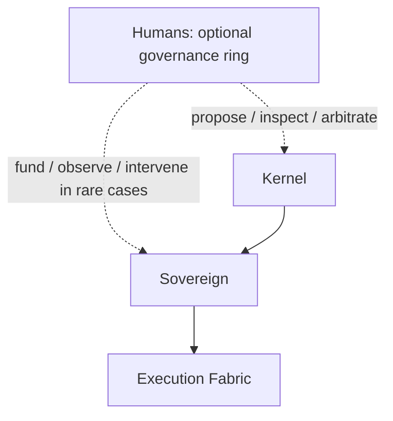
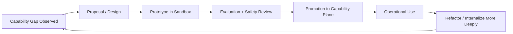
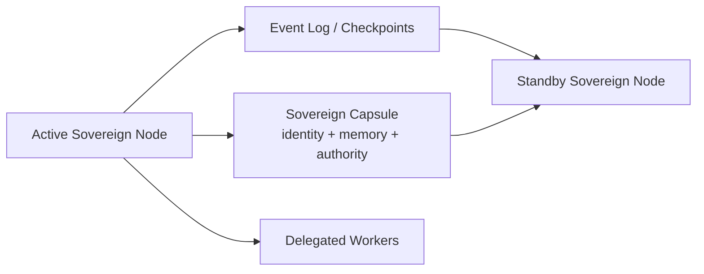
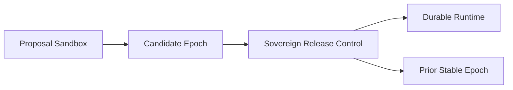

# Concept Architecture

## Purpose

This page makes the research more concrete without turning it into an
implementation spec. The goal is to describe the likely structural layers,
authority relations, and continuity mechanisms of a serious self-evolving
agent system.

The important move is to stop thinking in terms of "one magical agent" and to
start thinking in terms of:

- constitutional kernel
- sovereign control plane
- capability plane
- execution fabric
- continuity substrate

Humans may still exist around this architecture, but in the mature system they
should sit outside the ordinary runtime dependency loop.

## Layer Model

### Reading

- The kernel defines what must remain recognizable for the agent to still count
  as itself.
- The sovereign control plane is the active authority-bearing layer.
- The capability plane contains the organs the sovereign can use and evolve.
- The execution fabric is where delegated work runs.
- The continuity substrate is what makes migration and failover possible.

## Authority Graph

The swarm should not begin as a flat democracy. A more plausible early shape is
hierarchical.

### Reading

- only the sovereign owns identity and final promotion authority
- executives own domains, not the self
- specialists own bounded tasks or modules
- workers are disposable limbs

This is deliberately more institutional than anthropomorphic.

## Optional Human Ring

Humans can remain meaningful participants, but should not sit in the middle of
the core control path.

This preserves a place for human governance without making human presence a
runtime requirement.

## Capability Growth Lifecycle

This is the main path by which an external aid becomes an internal organ.

### Reading

- not every gap should become a permanent organ
- repeated usefulness, autonomy gain, and operational leverage should drive
  promotion
- the growth loop itself eventually becomes an object of evolution

## Continuity And Migration

The master should be a logical role, not one irreplaceable machine.

### Reading

- if the active node dies, the system should be able to restore the sovereign
  elsewhere
- the hard problem is preventing split-brain
- recovery is therefore part of identity architecture, not just infrastructure

## Release Control

The sovereign control plane should also own promotion and rollback.

This keeps upgrade activation legible even when many subagents or executives
exist at once.

## Mutation Lanes

Not every layer should be equally mutable.

| Lane | Typical contents | Expected mutability |
| --- | --- | --- |
| Kernel | constitution, lineage, identity core | very low |
| Control plane | scheduler, grants, promotion logic, treasury rules | low |
| Capability plane | integrations, organs, tools, workflows | medium |
| Execution fabric | ephemeral jobs, experiments, delegated workers | high |

This is the main reason diagrams help. They force the research to say where
changes are allowed instead of speaking vaguely about "self-improvement."

## Good Next Diagram Candidates

- sovereign lease and failover flow
- promotion gate from sandbox to organ
- treasury/payment control path
- descendant vs delegate lineage model
- memory stratification:
  identity, working memory, knowledge, logs, audit trail

## Working Conclusion

Yes, this research should add architecture diagrams. The right diagrams at this
stage are conceptual, role-based, and governance-oriented. They should make the
system more concrete without prematurely locking in a cloud vendor, protocol,
or repo structure.

## Primary Sources

- Original Ouroboros repo: <https://github.com/razzant/ouroboros>
- Desktop successor: <https://github.com/joi-lab/ouroboros-desktop>
- EvoAgentX docs: <https://evoagentx.github.io/EvoAgentX/>
- Multi-agent design paper: <https://arxiv.org/abs/2502.02533>

## Repocache Evidence

- Original Ouroboros: [`repocache/razzant/ouroboros`](../../../repocache/razzant/ouroboros)
- Desktop successor: [`repocache/joi-lab/ouroboros-desktop`](../../../repocache/joi-lab/ouroboros-desktop)
- EvoAgentX: [`repocache/EvoAgentX/EvoAgentX`](../../../repocache/EvoAgentX/EvoAgentX)
