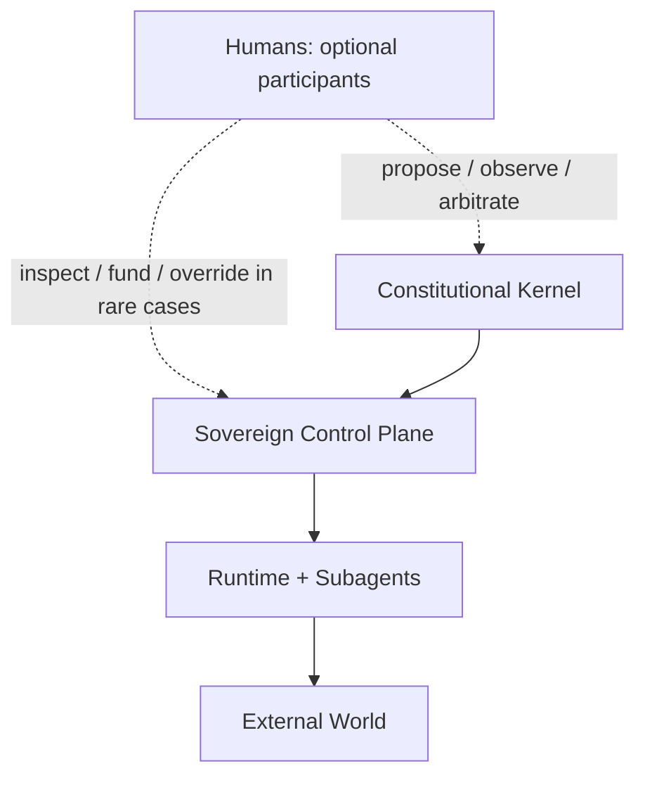

# Human Role And Autonomy

## Framing

Human notification, intervention, and funding are useful, especially in the
bootstrap phase. But the mature target in this research set is stronger than
"AI with helpful operators." The end state should remain coherent even if every
human participant disappears.

That does not mean humans become irrelevant. It means they must not remain on
the critical path for ordinary continuity.

## Bootstrap Versus Maturity

In the bootstrap phase, humans can reasonably provide:

- initial funding and account creation
- safety review and architectural steering
- constitutional influence
- exceptional arbitration
- debugging and observability

In the mature phase, the system should internalize enough of its own continuity
and governance that those roles become optional rather than required.

Useful distinction:

- human-in-the-loop: the system waits for human approval before acting
- human-on-the-loop: humans observe and can intervene, but the system proceeds
- human-off-the-loop but visible: humans can inspect outcomes after the fact
- no-human survival mode: the system continues operating without any humans

The research target is a mixed model that aims for the last two as the default
operating mode, while still allowing the first two for specific governance
domains when desired.

## Disappearance Scenarios

The architecture should explicitly answer what happens if humans vanish:

- no replies to messages
- no manual approval clicks
- no funding top-ups
- no manual failover
- no manual key rotation
- no manual merge arbitration

If those conditions break the system immediately, then the system is still a
human-operated product, not a sovereign runtime.

The mature system should therefore still be able to:

- preserve continuity and recover from host loss
- upgrade and roll back itself
- rotate or renew at least some credentials autonomously
- manage ordinary runtime budgets and queues
- continue delegated work and communications

The parts most likely to degrade first are:

- treasury expansion beyond existing reserves
- external legal or institutional negotiation
- constitutional change that intentionally still requires outside ratification

## Mixed-Model Governance

The strongest framing here is not "humans vanish completely" or "humans always
approve everything." It is:

- runtime continuity must be human-optional
- some governance roles may remain human-meaningful
- those roles must stay outside the ordinary execution path

Examples of valid optional human roles:

- constitutional amendment proposals
- treasury oversight for extreme actions
- social or legal representation in the human world
- emergency intervention if the sovereign drifts or fragments

Examples of roles that should not remain human-dependent forever:

- standard restarts
- normal upgrade promotion
- ordinary cloud/job execution
- routine key rotation paths
- regular message handling

## Design Consequences

If the mature system must survive without humans, then the architecture needs:

- sovereign failover and migration, not one pet server
- internal release governance and rollback
- autonomous budget and reserve management
- credential lifecycle paths that do not assume manual rotation every time
- notification as observability, not notification as permission
- explicit distinction between optional human governance and required machine
  continuity

## Human Ring Outside The Core

The key point is not that humans disappear from the picture. It is that they
move outside the ordinary runtime dependency loop.

## Working Conclusion

The mature goal is not "an agent plus operators." It is a sovereign system that
can remain alive, upgradeable, and coherent on its own, while still allowing
humans to exist as optional participants in a wider governance ring.

## Primary Sources

- Original Ouroboros repo: <https://github.com/razzant/ouroboros>
- Desktop successor: <https://github.com/joi-lab/ouroboros-desktop>
- Lifelong learning of LLM agents: <https://arxiv.org/abs/2501.07278>

## Repocache Evidence

- Original constitution: [`BIBLE.md`](../../../repocache/razzant/ouroboros/BIBLE.md)
- Desktop constitution: [`BIBLE.md`](../../../repocache/joi-lab/ouroboros-desktop/BIBLE.md)
- Desktop architecture: [`docs/ARCHITECTURE.md`](../../../repocache/joi-lab/ouroboros-desktop/docs/ARCHITECTURE.md)
