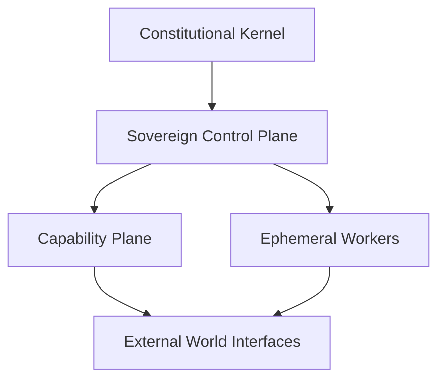

# Ouroboros Research

Source-first internal notes on Ouroboros, self-evolving agents, and the wider
architecture questions that appear once an agent is allowed to rewrite itself,
grow new capabilities, survive host failure, and coordinate subordinate agents.

This folder is intentionally broader than one repo review. `razzant/ouroboros`
is the seed example, but the real question is larger:

> What would it take to move from a self-modifying single-agent proof of
> concept to a durable distributed autonomous institution with continuity,
> governance, migration, and selective capability growth?

Short answer, as of 2026-03-25: the interesting leap is not "more tools." It is
the transition from a static runtime to a sovereign system that can evolve its
own body while preserving identity, authority, and safety constraints.

## Why This Matters

- Ouroboros gives a vivid concrete example of Git-backed self-modification,
  persistent identity, background cognition, and constitution-driven framing.
- The desktop successor shows how that idea starts hardening into a more serious
  runtime with an immutable outer shell, stronger safety controls, and a local
  app model.
- Adjacent projects such as EvoAgentX widen the lens from "one agent rewrites
  itself" to "workflows and agent ecosystems can be generated, evaluated, and
  evolved."
- The deeper research problem is continuity under change: if an agent can grow,
  fork, migrate, and delegate, what keeps it the same being rather than a loose
  cloud of related processes?

## Focus Areas

- what the current Ouroboros repos actually implement
- lineage, successors, and concept cousins
- self-evolution as seeded growth rather than blank emergence
- sovereign identity, constitutions, and lineage
- capability acquisition and plugin-like organ growth
- subagent hierarchy, delegation, and revocation
- migration, failover, and split-brain prevention
- external-world interfaces: cloud, secrets, comms, browser, payments
- safety, control, and bounded self-modification
- adjacent papers, essays, and projects discovered through Firecrawl

## Index

- [`OuroborosPoC.md`](OuroborosPoC.md)
- [`HistoricalEvolution.md`](HistoricalEvolution.md)
- [`ConceptArchitecture.md`](ConceptArchitecture.md)
- [`HumanRoleAndAutonomy.md`](HumanRoleAndAutonomy.md)
- [`LineageAndForks.md`](LineageAndForks.md)
- [`SelfEvolution.md`](SelfEvolution.md)
- [`SovereignIdentity.md`](SovereignIdentity.md)
- [`CapabilitiesAndOrgans.md`](CapabilitiesAndOrgans.md)
- [`SubagentsAndGovernance.md`](SubagentsAndGovernance.md)
- [`ContinuityAndMigration.md`](ContinuityAndMigration.md)
- [`UpgradeAndPropagation.md`](UpgradeAndPropagation.md)
- [`ExternalWorldInterfaces.md`](ExternalWorldInterfaces.md)
- [`SafetyAndControl.md`](SafetyAndControl.md)
- [`RelatedProjectsAndResearch.md`](RelatedProjectsAndResearch.md)
- [`Sources.md`](Sources.md)

## Working Thesis

- The most useful contribution of Ouroboros is not "autonomous coding." It is
  the attempt to treat identity, memory, and self-modification as first-class
  runtime concerns.
- A serious self-evolving system should be understood in layers:
  constitutional kernel, sovereign control plane, capability plane, and
  ephemeral execution fabric.
- "Swarm" is too vague. The practical design problem is an authority graph:
  sovereigns, executives, specialists, ephemeral workers, leases, and
  promotion rules.
- Recovery is fundamental. If the sovereign depends on one host, continuity is
  accidental. Migration and failover are therefore part of identity design, not
  a later infrastructure optimization.
- Capability growth should be selective. The system should internalize
  high-value organs over time, not accumulate every integration as equal clutter.
- Human participation is valuable, especially early, but the mature runtime
  should remain coherent if all humans disappear.
- Upgrade is not only a Git problem. In the mature system it becomes a release,
  propagation, reconciliation, and rollback problem across epochs.

## Suggested Reading Paths

If you are new to this folder, do not read it strictly front to back. Start
with the path that matches the question you are actually asking.

### 1. "What is Ouroboros, really?"

Read in this order:

- [`OuroborosPoC.md`](OuroborosPoC.md)
- [`HistoricalEvolution.md`](HistoricalEvolution.md)
- [`LineageAndForks.md`](LineageAndForks.md)

This path is best if you want to understand the concrete repos before the
larger architecture.

### 2. "What would the next serious architecture look like?"

Read in this order:

- [`ConceptArchitecture.md`](ConceptArchitecture.md)
- [`SelfEvolution.md`](SelfEvolution.md)
- [`SovereignIdentity.md`](SovereignIdentity.md)
- [`ContinuityAndMigration.md`](ContinuityAndMigration.md)
- [`SubagentsAndGovernance.md`](SubagentsAndGovernance.md)

This path is best if you care more about the future system shape than the repo
history.

### 3. "How does the agent grow capabilities?"

Read in this order:

- [`SelfEvolution.md`](SelfEvolution.md)
- [`CapabilitiesAndOrgans.md`](CapabilitiesAndOrgans.md)
- [`ExternalWorldInterfaces.md`](ExternalWorldInterfaces.md)
- [`SafetyAndControl.md`](SafetyAndControl.md)

This path focuses on seeded growth, integration absorption, and control.

### 4. "What else should we study besides Ouroboros?"

Read in this order:

- [`RelatedProjectsAndResearch.md`](RelatedProjectsAndResearch.md)
- [`LineageAndForks.md`](LineageAndForks.md)
- [`Sources.md`](Sources.md)

This path is best if you want the broader ecosystem and next source candidates.

### 5. "What happens if all humans disappear?"

Read in this order:

- [`HumanRoleAndAutonomy.md`](HumanRoleAndAutonomy.md)
- [`SafetyAndControl.md`](SafetyAndControl.md)
- [`ContinuityAndMigration.md`](ContinuityAndMigration.md)

This path is best if you care about whether the system can survive without
human operators, funders, or reviewers.

### 6. "How does the system upgrade safely?"

Read in this order:

- [`HistoricalEvolution.md`](HistoricalEvolution.md)
- [`UpgradeAndPropagation.md`](UpgradeAndPropagation.md)
- [`SubagentsAndGovernance.md`](SubagentsAndGovernance.md)
- [`ContinuityAndMigration.md`](ContinuityAndMigration.md)

This path is best if you care about restart-based upgrades today and
distributed runtime propagation later.

## Concept Sketch

The current working architecture hypothesis is not "one giant self-editing
process." It is a layered sovereign system:

That sketch is expanded in [`ConceptArchitecture.md`](ConceptArchitecture.md).

## How To Expand This Research

The next useful expansion should make the folder more concrete without jumping
all the way to implementation detail.

Good next additions:

- more conceptual architecture diagrams:
  sovereign failover, authority graph, capability growth lifecycle, promotion
  pipeline
- a page on mutation lanes and promotion gates as a formal governance model
- a page comparing direct lineage repos with concept cousins in a small matrix
- a page on treasury and economic control once payments become first-class
- a page on evaluation:
  how a self-evolving system should test itself before promoting new organs
- more release and continuity diagrams:
  epoch propagation, rollback, runtime inheritance, and optional-human survival

Recommended rule for future additions:

- add diagrams when they clarify authority, continuity, or data flow
- keep them conceptual and role-based, not service-name specific
- avoid fake precision until the research has actually chosen a concrete stack

## Source Policy

This section prefers:

1. official docs, specs, papers, and project-maintained materials
2. local source evidence from `repocache/`
3. essays and blogs only when they add useful framing beyond primary sources

Each page should make its conceptual claims traceable to either live web
references, `repocache` source paths, or both.

## Primary Sources

- Original Ouroboros repo: <https://github.com/razzant/ouroboros>
- Desktop successor: <https://github.com/joi-lab/ouroboros-desktop>
- EvoAgentX repo: <https://github.com/EvoAgentX/EvoAgentX>
- EvoAgentX docs: <https://evoagentx.github.io/EvoAgentX/>
- Self-evolving agent survey: <https://arxiv.org/abs/2508.07407>

## Repocache Evidence

- [`repocache/razzant/ouroboros`](../../../repocache/razzant/ouroboros)
- [`repocache/joi-lab/ouroboros-desktop`](../../../repocache/joi-lab/ouroboros-desktop)
- [`repocache/EvoAgentX/EvoAgentX`](../../../repocache/EvoAgentX/EvoAgentX)
