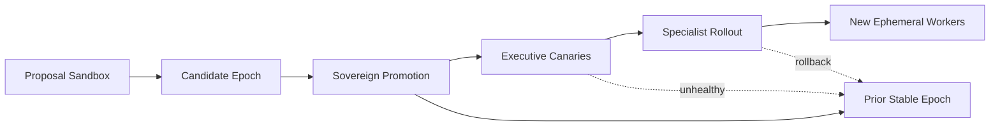

# Upgrade And Propagation

## Framing

A self-evolving system does not upgrade in only one sense. There are at least
four layers:

- source change
- artifact change
- runtime activation
- state migration

Git handles only part of that problem. A mature distributed sovereign needs a
release model above raw source control.

## How Ouroboros Upgrades Today

The current Ouroboros lineage upgrades at a process boundary, not by live
in-process hot-swap.

In the original repo:

- the agent edits its repo
- commits or pushes changes
- requests restart
- the supervisor checks out the dev branch, syncs dependencies, runs an import
  test, and only then allows activation
- if the dev branch fails import, it falls back to `ouroboros-stable`
- if there are unsynced local changes, it creates a rescue snapshot before reset

That is already a real upgrade story. It is just local and restart-mediated.

The desktop successor hardens the model:

- an immutable outer launcher remains outside the editable runtime
- the inner server is self-editable
- safety-critical files are overwritten from the bundle on launch
- the launcher restarts the inner runtime on exit code `42`
- local stable promotion remains available

This is a stronger sovereign bootstrap pattern than a single self-editing
process with no outer shell.

## Why Git Alone Is Not Enough

Once the system becomes distributed, Git merge is necessary but insufficient.
The runtime also needs to know:

- which release is desired
- which release is active on which node
- which capability set is inherited by which subagent
- which schema version the state currently uses
- how to roll back without split-brain or mixed-version confusion

That is why the research target should be an epoch-based release model.

## Epoch Model

A useful conceptual state set is:

- `stable_epoch`
- `candidate_epoch`
- `desired_epoch`
- `active_epoch_per_node`
- `state_schema_version`
- `capability_manifest_version`

An epoch is more than a commit. It should bundle:

- code or artifact digest
- prompt/policy version
- capability manifest
- migration steps
- evaluation evidence
- rollback target

## Propagation Across Durable Subagents

If subagents inherit organs and remain durable, then upgrades cannot work as
"everyone pulls latest source whenever convenient."

A better propagation model is:

1. the sovereign promotes a candidate epoch
2. executives reconcile first as canaries
3. specialists roll next by domain
4. new ephemeral workers inherit the new epoch at spawn time
5. old workers either finish, drain, or are terminated according to policy

That keeps upgrade authority legible and avoids uncontrolled peer-to-peer drift.

## Merge At Runtime, Not Only In Git

Horizontally scaled upgrade development creates two distinct merge problems.

### Source Merge

- branch merge or rebase
- conflict resolution
- module ownership and mutation-lane discipline

### Runtime Merge

- combine capability manifests
- order schema migrations
- decide if multiple proposals can coexist in one epoch
- rerun evaluation on the combined candidate
- publish a single promoted runtime epoch

In other words, the sovereign should merge release candidates, not just source
branches.

## Rollback And Fencing

Rollback in a mature system should mean:

- revert desired epoch to prior stable epoch
- fence the broken epoch from further activation
- drain or terminate affected nodes
- rehydrate state under the prior compatible schema path

This is different from simply resetting a branch. The runtime must prevent old
and new sovereign claims from both remaining active.

## Upgrade Propagation Sketch

## Working Conclusion

Current Ouroboros already has a meaningful local upgrade pattern:
edit, restart, verify, stable fallback.

The next research step is to generalize that into:

- release epochs
- reconciliation across durable subagents
- runtime inheritance rules
- rollback and fencing
- migration-aware activation

That is the point where self-modification becomes a distributed systems
discipline rather than just a coding-agent trick.

## Primary Sources

- Original repo releases: <https://github.com/razzant/ouroboros/releases>
- Original commit history: <https://github.com/razzant/ouroboros/commits/main/>
- Desktop successor repo: <https://github.com/joi-lab/ouroboros-desktop>

## Repocache Evidence

- Original control tools: [`ouroboros/tools/control.py`](../../../repocache/razzant/ouroboros/ouroboros/tools/control.py)
- Original restart and fallback: [`supervisor/git_ops.py`](../../../repocache/razzant/ouroboros/supervisor/git_ops.py)
- Original restart event flow: [`supervisor/events.py`](../../../repocache/razzant/ouroboros/supervisor/events.py)
- Desktop architecture: [`docs/ARCHITECTURE.md`](../../../repocache/joi-lab/ouroboros-desktop/docs/ARCHITECTURE.md)
- Desktop restart and stable promotion: [`supervisor/git_ops.py`](../../../repocache/joi-lab/ouroboros-desktop/supervisor/git_ops.py)
- Desktop promote handler: [`supervisor/events.py`](../../../repocache/joi-lab/ouroboros-desktop/supervisor/events.py)
